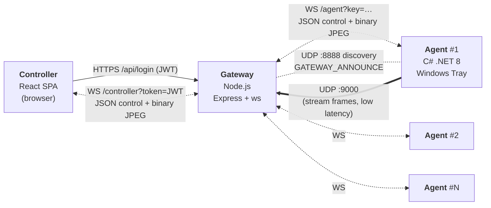

# Kiến trúc Hệ thống

> Tài liệu này mô tả **trạng thái hiện tại** của toàn bộ monorepo: cây thư mục, vai trò từng file, các store Zustand và action, luồng dữ liệu, danh sách message được hỗ trợ, các module đã hoàn thiện và các quy ước đang được áp dụng. Cách chạy xem [`README.md`](README.md) và [`controller/README.md`](controller/README.md).

---

## 1. Tổng quan



- **Star topology** — Agent không nói chuyện trực tiếp với Controller; mọi traffic đi qua Gateway.
- **Cùng một WebSocket** vừa mang JSON control vừa mang binary JPEG (screen + webcam).
- **UDP :9000** — Agent bắn frame stream nhanh về Gateway để giảm overhead WebSocket.
- **UDP :8888** — Agent lắng nghe gói `GATEWAY_ANNOUNCE|ws://ip:port` để auto-discover Gateway trong LAN.
- **HTTPS/HTTP** — chỉ dùng cho REST `POST /api/login`, `GET /health`, `GET /api/agents`.

---

## 2. Cây thư mục & vai trò từng file

### 2.1. Root
```
remote-computer-control/
├── Architecture.md            Tài liệu này
├── README.md                  Trang chủ monorepo (giới thiệu + link)
├── docs/                      Tài liệu chung
│   ├── protocol/              Schema canonical của mọi message JSON
│   ├── design/                Thiết kế chi tiết từng subsystem
│   └── reports/               Báo cáo đánh giá
├── controller/                React SPA — xem 2.2
├── gateway/                   Node.js relay — xem 2.3
└── agent/                     C# tray app — xem 2.4
```

### 2.2. Controller (`controller/`)
```
controller/
├── package.json               React 19 + Vite + Zustand 5 + lucide-react + recharts
├── vite.config.js             Vite config, `VITE_USE_MOCK` env
├── index.html
└── src/
    ├── main.jsx               ReactDOM.createRoot, mount <App/>
    ├── App.jsx                Auth gate: token null → <LoginScreen>; có token → <ConsoleShell>
    ├── App.css / index.css    Theme tokens + global reset
    │
    ├── components/
    │   ├── FrameCanvas.jsx        Vẽ 1 JPEG (ArrayBuffer) lên <canvas>. Hỗ trợ delta encoding: keyframe resize canvas + vẽ (0,0); non-keyframe vẽ diff-rect tại (meta.x, meta.y) không reset canvas.
    │   ├── LoginScreen.jsx        Form đăng nhập, gọi AuthService, lưu JWT vào sessionStorage + ConnectionStore.
    │   ├── ModuleTable.jsx        Bảng chung (sort/filter) dùng chung cho App/Process.
    │   ├── PermissionGate.jsx     HOC bọc mỗi module tab. Expose useGuardedSend + usePendingConsent qua React context — click nút gọi guardedSend(fn), nếu chưa cấp thì queue + xin quyền.
    │   ├── agents/
    │   │   ├── AgentCard.jsx      Ô hiển thị 1 agent (tên, status, checkbox multi-select).
    │   │   ├── AgentList.jsx      Danh sách agent trong Sidebar, filter theo search query.
    │   │   └── MultiSelect.jsx    Toggle chọn nhiều agent để bắn lệnh bulk.
    │   ├── layout/
    │   │   ├── Sidebar.jsx        Panel trái: logo, search, AgentList, gateway status.
    │   │   ├── TopBar.jsx         Header: tên focused agent, theme toggle, logout.
    │   │   └── ThemeToggle.jsx    Nút đổi light/dark theme.
    │   ├── livescreen/
    │   │   ├── GridView.jsx       Lưới thumbnail nhiều agent, dùng FrameCanvas nhỏ.
    │   │   └── FocusView.jsx      1 agent focus + tab bar 8 module + PermissionGate wrap.
    │   └── modules/               Mỗi module 1 folder, chỉ có index.jsx
    │       ├── ApplicationTab/    List/start/stop app (whitelist). Poll 3 s (silent).
    │       ├── ProcessTab/        List/kill process. Poll 3 s (silent).
    │       ├── ScreenTab/         Screenshot + start/stop stream + toggle "Điều khiển" (Remote Input). Bọc canvas bằng div tabIndex bắt onMouseMove/Down/Up/ContextMenu/KeyDown/KeyUp → gửi input_*.
    │       ├── KeylogTab/         Terminal log, gộp ký tự liên tiếp thành 1 dòng, Enter ngắt dòng; export .txt cùng định dạng đã gộp.
    │       ├── FileTab/           Sandbox browser, upload/download chunked binary.
    │       ├── WebcamTab/         MJPEG stream, dùng FrameCanvas với label="WEBCAM".
    │       ├── SysInfoTab/        CPU/RAM/Disk/uptime realtime. Poll 3 s (silent).
    │       └── PowerTab/          lock / restart / shutdown / sleep + 10 s countdown UI.
    │
    ├── hooks/
    │   └── UseAgentSocket.js      Singleton socket (refcount, ONE global connection). Public API: sendCommand, sendToFocused, sendToSelected, requestPermission, revokePermission, stopModule. Nhận message → dispatch vào store phù hợp; nhận binary → pair với frame_meta (stream) hoặc fs_get_result (file, keyed by transfer_id).
    │
    ├── services/
    │   ├── index.js               ONE place chọn mock vs real: `USE_MOCK = import.meta.env.VITE_USE_MOCK !== 'false'`. Default = mock.
    │   ├── Socket.js              Wrap trình duyệt WebSocket, callback onOpen/onMessage/onBinary/onClose/onError, gắn token vào query string.
    │   ├── MockSocket.js          Sim Gateway+Agent trong browser: nhận JSON, delay, echo lại đúng schema. Sinh JPEG placeholder cho screen/webcam.
    │   ├── Protocol.js            Builders (buildXxx), validators (assertInt/String/Path), MSG_TYPE, MODULE, FEATURE, POWER_ACTION, normalizeIncoming (chuẩn hoá snake_case tên field).
    │   └── AuthService.js         POST /api/login, refresh token cookie handling.
    │
    └── store/                     Zustand — xem 4.1
```

### 2.3. Gateway (`gateway/`)
```
gateway/
├── package.json               Express + ws + better-sqlite3 + bcrypt + jsonwebtoken + AJV + winston
├── nodemon.json               Dev auto-reload
└── src/
    ├── index.js               Boot: init DB, start server, register signal handlers.
    ├── server.js              1 HTTP(S) server + WebSocketServer(noServer:true), route upgrade theo pathname.
    ├── config.js              Read .env, expose port, allowedOrigins, JWT secret, TLS cert paths, AGENT_KEY.
    ├── db.js                  better-sqlite3 handle + prepared statements (getUserByUsername, getUserById, refresh_tokens CRUD, agent CRUD).
    │
    ├── auth/
    │   └── login.js           POST /api/login (bcrypt verify SQLite, phát JWT 8 h + refresh cookie), /api/refresh, /api/logout.
    ├── middleware/
    │   └── auth.js            Verify Bearer JWT (REST) + verify JWT trong WS upgrade query.
    ├── router/
    │   └── messageRouter.js   Whitelist type, đọc target_agents, forward raw. Broadcast (target_agents rỗng) CHỈ được phép với policy_update; các type khác bị reject với error_ack.
    ├── socket/
    │   ├── agentHandler.js    /agent?key=… — verify key, register vào agentStore, relay message ngược lên controllerStore.
    │   └── controllerHandler.js  /controller?token=JWT — verify JWT, register vào controllerStore, route command theo messageRouter.
    ├── store/
    │   ├── agentStore.js      Map<agent_id, ws> (in-RAM).
    │   ├── controllerStore.js Set<ws> (in-RAM).
    │   ├── heartbeat.js       Ping loop 30 s, đóng socket im lặng.
    │   ├── data.sqlite        Persistence chính (users, agents, refresh_tokens).
    │   ├── users.json         Seed cho migration ban đầu.
    │   └── agents.json        Seed cho migration ban đầu.
    ├── udp/
    │   └── udpServer.js       :9000 nhận stream frame từ Agent, :8888 phát GATEWAY_ANNOUNCE.
    ├── utils/
    │   └── logger.js          Winston rolling: gateway.log 10 MB×5, error.log 5 MB×3.
    └── validation/
        └── commandSchemas.js  AJV schema per module để validate params trước khi forward.
```

### 2.4. Agent (`agent/`)
```
agent/
├── agent.csproj / agent.sln   .NET 8 Windows Forms
├── Program.cs                 [STAThread] Main: ConfigManager → nếu gateway_url rỗng dùng GatewayConfigForm → DI container → đăng ký 9 module → Application.Run(new TrayApp(agent)).
├── config.json                agent_id, gateway_url, auth_key, app_whitelist, sandbox_root_path, log_retention_days, consent_timeout_ms, tray_password.
│
├── Core/
│   ├── AgentClient.cs             Singleton chủ ClientWebSocket + SemaphoreSlim send lock. Route command theo _moduleRegistry. Xử lý permission_request / permission_revoke / stop_module.
│   ├── IAgentContext.cs           Interface expose AgentId + SendResponse cho module không phụ thuộc AgentClient trực tiếp.
│   ├── MessageDispatcher.cs       Deserialise JSON → CommandPacket, gọi AgentClient.RouteCommand.
│   └── WebSocketClient.cs         Low-level wrap ClientWebSocket, reconnect + heartbeat.
│
├── Managers/
│   ├── UIManager.cs               Consent popup (ConsentForm, TCS-based, hard timeout + 2 s slack, enum ConsentOutcome Granted/Declined/Timeout/Busy). Overlay: OverlayForm (red-dot cho webcam), InputOverlayForm (blue "K" cho Remote Input, top-LEFT, Dispose flashTimer khi form đóng). ShowCountdown cho webcam/screen.
│   ├── SecurityManager.cs         App whitelist + sandbox path normalization + consent gate.
│   ├── ConfigManager.cs           Load/save config.json, gắn secret vào keychain nếu có.
│   ├── AuditLogger.cs             Log mọi permission_request/revoke + command đã thực thi.
│   └── LogCleanupJob.cs           Timer xoá log Serilog cũ hơn log_retention_days.
│
├── Modules/                       9 module, đều kế thừa BaseModule (IAgentContext + SecurityManager + UIManager).
│   ├── BaseModule.cs              abstract: SupportedCommands, ExecuteAsync, virtual OnDisconnected.
│   ├── AppModule.cs               app_list / app_start / app_stop (chỉ chạy app trong whitelist).
│   ├── ProcessModule.cs           proc_list / proc_kill (PID).
│   ├── KeyloggerModule.cs         keylog_start/stop + global low-level keyboard hook, gửi keylog batch.
│   ├── WebcamModule.cs            webcam_start/stop, MJPEG 15 fps, hiện red-dot overlay khi bật.
│   ├── FileModule.cs              fs_list / fs_get / fs_put — chunk 512 KB, sha256 verify, sandbox root. HandleBinaryChunk cho upload.
│   ├── StreamModule.cs            screenshot + screen_stream/stop. MD5 change detection + Software Bounding Box Delta Encoding (LockBits unsafe). Keyframe mỗi 30 frame.
│   ├── PowerModule.cs             lock / restart / shutdown / sleep (thẻ Win32 Shutdown API).
│   ├── SysInfoModule.cs           sysinfo — CPU/RAM/Disk/uptime/hostname/IP/OS (PerformanceCounter + WMI).
│   └── InputModule.cs             input_mouse_move (fire-and-forget) / input_mouse_click / input_key / input_type qua SendInput. State-flip (isIndicatorActive) bọc trong _stateLock, WinForms call ngoài lock. OnDisconnected force-hide overlay.
│
├── Forms/
│   ├── TrayApp.cs                 NotifyIcon + context menu (Reconfigure / Reset / Exit — có tray_password).
│   ├── GatewayConfigForm.cs       Dialog nhập gateway_url + auth_key khi config trống.
│   └── PasswordPromptForm.cs      Prompt tray_password trước khi cho phép action nhạy cảm.
│
├── Models/
│   ├── AppConfig.cs               POCO map config.json.
│   └── CommandPacket.cs           POCO cho message inbound (type, command_id, module, feature, params, target_agents).
│
├── Utils/
│   ├── ImageUtils.cs              Bitmap → JPEG với quality parameter, LockBits helper cho diff detection.
│   └── UdpStreamSender.cs         Bắn frame ra UDP :9000 Gateway.
│
└── Logs/                          Serilog rolling daily (auto-clean).
```

---

## 3. Giao thức (Protocol)

Schema canonical: [`docs/protocol/*.json`](docs/protocol/) — 12 file JSON + [`Instruction.md`](docs/protocol/Instruction.md).

### 3.1. Ba lớp message

| Lớp | Chiều | Đặc trưng | Ví dụ |
|---|---|---|---|
| **request** | Controller → Gateway → Agent | Có `command_id`, `module`, `params`, `target_agents`. Gateway forward raw. | `{type:"request", command_id, module:"sysinfo", params:{}, target_agents:["PC-01"]}` |
| **response** | Agent → Gateway → Controller | Suffix `_result` / `_error` / `_denied`. Gateway stamp `agent_id`. | `sysinfo_result`, `fs_put_complete`, `keylog_denied`, `power_result`, `input_result` |
| **event** | Không solicited | Không có `command_id`. `agents_list`, `agent_status`, `frame_meta` (+ binary JPEG), `keylog`, `policy_update`, `input_started/stopped`, `auth_expired`. | `{type:"agent_status", agent_id, online:true}` |

### 3.2. Danh sách message hiện được hỗ trợ

**TX (Controller → Gateway):** `list_agents`, `request` (wrapper cho hầu hết command), `power`, `policy_update`, `permission_request`, `permission_revoke`, `stop_module`.

**RX (Gateway/Agent → Controller):**

| Nhóm | Message types |
|---|---|
| Agent status | `agents_list`, `agent_status` |
| Application | `app_list_result`, `app_action_result` |
| Process | `proc_list_result`, `proc_kill_result` |
| Screen (livescreen) | `frame_meta` (+ binary JPEG), `stream_started`, `stream_stopped` |
| Keylog | `keylog`, `keylog_started`, `keylog_stopped`, `keylog_denied` |
| Webcam | `frame_meta` (+ binary JPEG), `webcam_started`, `webcam_stopped`, `webcam_denied` |
| File | `fs_list_result`, `fs_get_result` (+ binary chunk), `fs_put_result`, `fs_put_complete`, `fs_error` |
| Power | `power_result` |
| SysInfo | `sysinfo_result` |
| Remote Input | `input_started`, `input_stopped`, `input_denied` (`reason` ∈ `"user declined" | "timeout" | "busy"`), `input_result` |
| Policy | `policy_update_result` |
| Permission | `permission_result` |
| Auth | `auth_expired` |

### 3.3. `feature` vs `module`

- **feature** = permission group (đơn vị consent) — dùng trong `permission_request/revoke`. Giá trị: `application`, `process`, `screen`, `keylog`, `file`, `webcam`, `power`, `input`.
- **module** = command namespace (đơn vị lệnh) — dùng trong `request.module`. Ví dụ: `screenshot`, `screen_stream`, `input_mouse_move`, `fs_get`, …

**Remote Input** dùng feature riêng `"input"` (KHÔNG dùng chung với `"screen"`). 4 module `input_mouse_move / input_mouse_click / input_key / input_type` cùng thuộc feature này.

### 3.4. Binary frame — pairing pattern

Có **hai kênh** binary trên cùng một WS:

1. **Frame ảnh (screen / webcam)** — cặp `frame_meta` JSON + binary JPEG kế tiếp. Controller pair theo **thứ tự nhận** (không có ID).
2. **File chunk (`fs_get_result`)** — cặp `fs_get_result` JSON (chứa `transfer_id` **bắt buộc**) + binary bytes kế tiếp. Controller pair theo `transfer_id` (Map) — hỗ trợ nhiều download song song trên cùng socket. Message thiếu `transfer_id` bị Controller drop.

### 3.5. Delta encoding cho screen stream

`frame_meta` cho `module="screen"` mang thêm:
- `is_keyframe` (bool) — true = full frame, false = diff rect.
- `x`, `y`, `w`, `h` — bounding box của vùng thay đổi.
- Keyframe: canvas được resize theo `w/h` rồi vẽ tại (0,0).
- Non-keyframe: vẽ tại (x,y) không resize (giữ nguyên pixel cũ ngoài rect).
- Cứ 30 frame Agent chèn 1 keyframe để tránh drift.

---

## 4. Controller — chi tiết

### 4.1. Zustand stores (6)

| Store | State | Actions |
|---|---|---|
| **AgentStore** | `agents: Agent[]`, `focused_agent_id`, `selected_agent_ids: string[]`, `search_query` | `setAgents`, `setAgentStatus(id, patch)`, `setFocused(id)`, `setSelectedIds(ids)`, `clearSelection`, `setSearchQuery(q)`, getters `getFilteredAgents`, `getFocusedAgent` |
| **ConnectionStore** | `status: 'idle'\|'open'\|'closed'`, `gateway_url`, `auth_token` | `connect(url)`, `disconnect`, `setStatus`, `setGatewayUrl`, `setAuthToken`, `clearAuthToken` |
| **ModuleStore** | `data: { [agent_id]: { app_list, proc_list, keylog[], keylog_active, sysinfo[], screen:{frame,meta}, screen_stream_active, webcam:{frame,meta}, webcam_active, input_active, file:{tree,path}, file_downloads:{ [transfer_id]:job }, file_put_ack } }` | `setModuleData`, `appendKeylog`, `appendSysInfo`, `setScreenStreamActive`, `setWebcamActive`, `setKeylogActive`, `setInputActive`, `setFsEntries`, `appendFileDownloadChunk`, `removeFileDownload`, `setFilePutAck`, `clearFilePutAck`, `clearModule`, `clearAgent`, `clearLiveFlagsForAgent`, `clearAllLiveFlags` |
| **PermissionStore** | `permissions: { [agent_id]: { [feature]: 'idle'\|'requesting'\|'granted'\|'denied' } }` | `requestPermission(agent_id, feature)`, `setPermissionResult(agent_id, feature, granted)`, `revoke(agent_id, feature)`, getter `getStatus(agent_id, feature)` |
| **PolicyStore** | `app_whitelist: string[]`, `sandbox_path: string`, `last_result: { [agent_id]: {success, message} }` | `setWhitelist`, `setSandboxPath`, `setPolicyResult(agent_id, result)` |
| **UiStore** | `theme: 'light'\|'dark'`, `layout_mode: 'grid'\|'focus'`, `active_tab: MODULE_TABS.*`, `toasts: [{id,msg,variant}]` | `setTheme`, `setLayoutMode`, `setActiveTab`, `addToast(msg, variant)` (auto-remove sau timeout) |

Mọi component subscribe **selector cụ thể** (`useStore(s => s.x)`) — không lấy toàn store.

### 4.2. Luồng dữ liệu: `component → hook → service → store`

**Outbound** (UI action → wire):
```
Component (onClick)
   → useGuardedSend()(fn)  ── PermissionGate: kiểm consent, queue nếu chưa cấp
       → useAgentSocket().sendCommand / sendToFocused / sendToSelected
           → services/Protocol.buildXxx()          ── build JSON đúng schema
           → services/index.js (AgentSocket)       ── Mock hoặc Real
               → socket.send(JSON.stringify(msg))
```

**Inbound** (wire → UI):
```
services/AgentSocket.onMessage(raw)
   → normalizeIncoming(raw)                        ── chuẩn snake_case
   → UseAgentSocket.dispatchMessage(msg)
       → switch(msg.type)
           → useModuleStore.setXxx / usePermissionStore.setPermissionResult / …
   → Component re-render qua selector Zustand

Binary frame:
services/AgentSocket.onBinary(bytes)
   → nếu có _pending_fs_chunks Map (fs_get_result đang chờ) → pair theo transfer_id, appendFileDownloadChunk
   → ngược lại nếu có _pending_meta (frame_meta) → setModuleData(agent_id, 'screen'|'webcam', {frame,meta})
   → ngược lại drop + warn
```

### 4.3. Pattern Mock ↔ Real socket

- `services/index.js` là **nơi DUY NHẤT** đọc `import.meta.env.VITE_USE_MOCK`. Default = mock (khi env vắng).
- `Socket.js` (real) và `MockSocket.js` có **cùng API shape**: `connect / close / send`, `onOpen / onMessage / onBinary / onClose / onError`.
- Toàn app import `AgentSocket from '../services'` — không biết mock hay real.
- `MockSocket` sinh JPEG placeholder cho screen/webcam, seed sẵn `app_list` / `proc_list` / `sysinfo`, mô phỏng consent popup (200 ms delay + auto-grant), và mọi `_result` / `_error` đúng schema.
- Đổi backend: chỉ set `VITE_USE_MOCK=false` trong `.env.local`. Không đổi code.

### 4.4. Consent flow (PermissionGate)

1. Component gọi `guardedSend(fn)`.
2. Nếu `PermissionStore.permissions[agent_id][feature] === 'granted'` → chạy `fn()` ngay.
3. Ngược lại: push `fn` vào queue, gọi `requestPermission(feature, agent_id)`, hiện spinner `is_pending_consent`.
4. Agent trả `permission_result { granted }` → dispatch `setPermissionResult` → PermissionGate drain queue theo thứ tự khi `granted=true`, hoặc toast lỗi khi `granted=false`.
5. Timeout 30 s: toast "Hết thời gian chờ cấp quyền" + clear queue.
6. Unmount tab hoặc đổi agent → auto `revokePermission` + `stopModule` cho feature đang mở.

---

## 5. Modules — trạng thái hoàn thiện

| Module | Feature | Command | Consent | Đã có |
|---|---|---|---|---|
| **Application** | `application` | `app_list`, `app_start`, `app_stop` | ✓ | List app whitelist, start/stop, poll 3 s silent. |
| **Process** | `process` | `proc_list`, `proc_kill` | ✓ | List process, kill PID, poll 3 s silent. |
| **SysInfo** | (none) | `sysinfo` | — (read-only) | CPU/RAM/Disk/uptime/hostname/IP/OS, poll 3 s silent, recharts sparkline. |
| **Screen** | `screen` | `screenshot`, `screen_stream`, `screen_stream_stop` | ✓ | 1-shot + live stream với delta encoding + keyframe mỗi 30 frame. Countdown 10 s trước khi bật stream. |
| **Remote Input** | `input` | `input_mouse_move`, `input_mouse_click`, `input_key`, `input_type` | ✓ (riêng) | Nút "Điều khiển" trên ScreenTab. Overlay blue "K" top-left ở Agent. Handlers onMouse*/onKey* trên wrapper canvas, remap toạ độ browser→Agent, throttle mouse_move 30 ms. Cleanup revoke khi rời tab. |
| **Keylog** | `keylog` | `keylog_start`, `keylog_stop` | ✓ | Terminal log gộp ký tự liên tiếp thành 1 dòng, Enter ngắt dòng, combo Ctrl+/Alt+ hiển thị riêng. Export .txt cùng format. |
| **Webcam** | `webcam` | `webcam_start`, `webcam_stop` | ✓ | MJPEG stream + red-dot overlay Agent. |
| **File** | `file` | `fs_list`, `fs_get`, `fs_put` | ✓ | Sandbox browser, chunk 512 KB, sha256, download song song (Map keyed by `transfer_id`), upload binary chunk. |
| **Power** | `power` | `power` (action: lock/restart/shutdown/sleep) | ✓ | 10 s countdown ở Controller trước lock=immediate, còn lại đếm ngược trước khi bắn lệnh. |
| **Policy** | — | `policy_update` | — (broadcast) | Push `app_whitelist` + `sandbox_path` fleet-wide (là type DUY NHẤT được phép broadcast). |

---

## 6. Quy ước (Conventions)

### 6.1. Code style

- **JS/JSX (Controller):** biến `snake_case`, hàm `camelCase`, component `PascalCase`, constants `UPPER_SNAKE_CASE`, file component `PascalCase.jsx`. Braces Allman (`{` trên dòng riêng). Comment tiếng Anh, đặt cạnh dòng (`//`) căn thẳng cột khi cụm nhiều dòng. Toast **UI copy** cho operator giữ tiếng Việt (nhất quán với UX).
- **C# (Agent):** class `PascalCase`, method `PascalCase`, private field `camelCase`, const `PascalCase` hoặc `ALL_CAPS` tuỳ ngữ cảnh. Braces Allman. XML doc chỉ dùng khi cần thiết; comment giải thích WHY, không WHAT.
- **JSON schema (docs/protocol):** `snake_case` cho mọi field. Thêm `_desc` / `_comment` để giải thích invariant.

### 6.2. Store discipline (Controller)

- Selector cụ thể: `useStore(s => s.data[agent_id]?.x ?? default)` — không `useStore(s => s)`.
- Setter **không** nested update: luôn `{...s.data, [id]: {...agent_data, x: v}}` để giữ immutability.
- Không mutation trong action; không hold state ở component khi có store phù hợp.

### 6.3. Hook lifecycle

- Mọi `useEffect / setInterval / setTimeout / event listener / socket handler / Blob URL` phải có cleanup trong return function.
- `useAgentSocket` là **singleton refcounted** — nhiều component mount đều dùng chung 1 WebSocket; unmount cuối cùng mới đóng socket.

### 6.4. Broadcast

- `messageRouter` chỉ cho phép `target_agents` rỗng khi `type === 'policy_update'`. Mọi type khác thiếu `target_agents` bị reject với `error_ack code:400`.

### 6.5. Auth

- JWT 8 h lưu `sessionStorage` (Controller) + refresh_token cookie HttpOnly.
- Gateway verify JWT ở WS upgrade query `?token=`.
- Agent auth qua shared `AGENT_KEY` trong config, gửi ở WS query `?key=`.

### 6.6. Sandbox & whitelist

- File: mọi `fs_*` bị hard-lock trong `config.json:sandbox_root_path`. Path normalization chống `..` traversal.
- Application: chỉ app trong `config.json:app_whitelist` được `app_start`. Push nóng qua `policy_update` (không cần restart Agent).

### 6.7. Consent

- Timeout mặc định 30 s.
- Anti-DoS: popup đang mở → request mới cho cùng feature auto-reject với `ConsentOutcome.Busy`.
- Reset toàn bộ quyền khi Agent disconnect (Controller cũng gọi `clearAllLiveFlags` khi socket close).
- `input_denied.reason` phân biệt `"user declined"` / `"timeout"` / `"busy"`.

---

## 7. Persistence

| Thành phần | Nơi lưu | Nội dung |
|---|---|---|
| Gateway — SQLite | `gateway/src/store/data.sqlite` (better-sqlite3) | `users` (id, username, password_hash bcrypt, role), `agents` (agent_id, secret_hash, display_name, created_at), `refresh_tokens` (jti, user_id, expires_at). |
| Gateway — seed | `store/users.json`, `store/agents.json` | Chỉ cho `scripts/migrate_from_json.js`, runtime không đọc. |
| Gateway — in-RAM | `Map<agent_id, ws>` + `Set<controller_ws>` | Session, xoá khi restart. |
| Gateway — logs | `logs/gateway.log`, `logs/error.log` | Winston rolling. |
| Agent — config | `agent/config.json` | agent_id, gateway_url, auth_key, app_whitelist, sandbox_root_path, log_retention_days, consent_timeout_ms, tray_password. |
| Agent — audit log | `agent/Logs/agent-YYYYMMDD.log` | Serilog rolling daily, auto-clean sau log_retention_days. |
| Controller | (không) | Stateless. `sessionStorage` giữ JWT + refresh cookie HttpOnly. Zustand hoàn toàn in-memory. |

---

## 8. Nơi tra cứu

- Schema JSON: [`docs/protocol/`](docs/protocol/) — nguồn duy nhất cho tên field.
- Thiết kế Controller: [`docs/design/controller/architecture.md`](docs/design/controller/architecture.md).
- Thiết kế Gateway: [`docs/design/gateway/technical_design.md`](docs/design/gateway/technical_design.md).
- Thiết kế Agent: [`docs/design/agent/technical_design.md`](docs/design/agent/technical_design.md).
- Đánh giá & bug still-open: [`docs/reports/evaluation.md`](docs/reports/evaluation.md).
