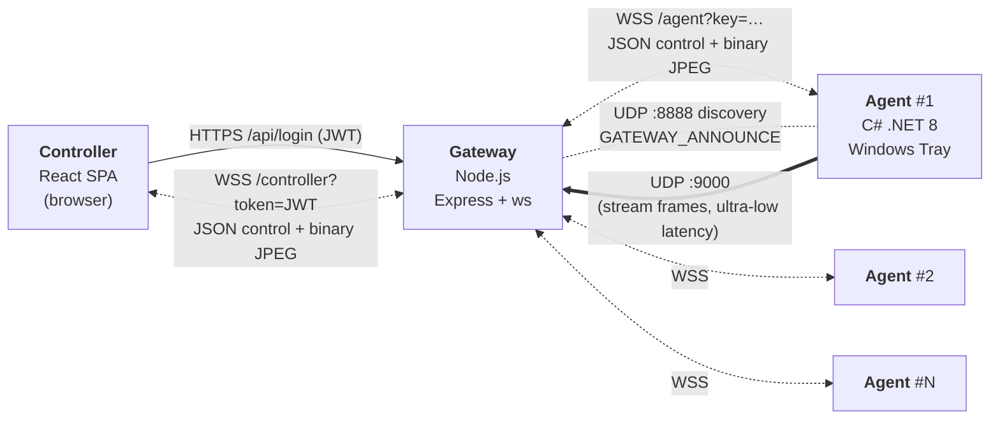
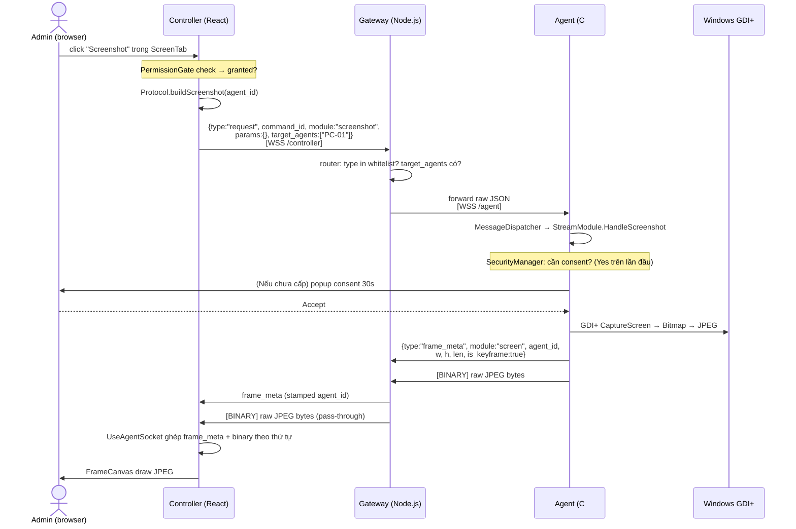

# Kiến trúc Hệ thống

> Tài liệu này giải thích **vì sao** hệ thống được thiết kế thế này — nguyên tắc, luồng dữ liệu, giao thức, ràng buộc. Cách chạy xem [`README.md`](README.md).

---

## 1. Tổng quan



**Star topology** — Agent không nói chuyện trực tiếp với Controller. Mọi giao tiếp đi qua Gateway. Không có mesh, không P2P, không rendezvous ngoài.

**Transport:**
- **HTTPS** (fallback HTTP dev) cho REST auth: `POST /api/login`, `GET /health`, `GET /api/agents`.
- **WSS** (fallback WS dev) cho lệnh + kết quả + frame ảnh — cùng 1 socket, cùng 1 port `:8080`.
- **UDP :9000** — Agent bắn stream frame lên Gateway để bypass overhead WebSocket khi cần fps cao. Gateway proxy ngược qua WSS về Controller (Controller vẫn nhận qua WS thường).
- **UDP :8888** — Agent lắng nghe gói `GATEWAY_ANNOUNCE|wss://ip:port` để auto-discover Gateway trong LAN.

---

## 2. Nguyên tắc thiết kế

| Nguyên tắc | Ý nghĩa & vị trí thực thi |
|---|---|
| **Consent-based** | Mọi module nhạy cảm (keylog, webcam, file, power, stream) bật dialog xác nhận ở Agent (timeout 30s, mặc định `consent_timeout_ms` trong `config.json`). Controller chỉ thấy dữ liệu **sau khi** user Agent bấm Accept. Anti-DoS: từ chối request mới nếu popup đang hiện. |
| **Star topology** | Đơn giản routing, dễ kiểm soát policy tập trung ở Gateway. Đổi lại: Gateway là **single point of failure** và bottleneck. |
| **Pass-through relay** | Gateway KHÔNG parse/decode payload nặng — chỉ đọc `target_agents`, forward raw. Binary frame giữ nguyên buffer, chỉ stamp `agent_id` vào JSON `frame_meta`. Mục tiêu: ≥24 fps live stream. |
| **Plaintext-first dev** | TLS optional (env `SSL_CERT_PATH` + `SSL_KEY_PATH`); dev mode fallback về HTTP/WS. Production bật WSS — chưa hoàn thiện. |
| **Sandbox file** | Agent hard-lock mọi thao tác `fs_*` trong `C:\AgentSandbox\` (`config.json:sandbox_root_path`). Path normalization chống path-traversal. |
| **Application whitelist** | Chỉ app trong `config.json:app_whitelist` được `app_start`. Whitelist push nóng qua `policy_update` — cập nhật RAM, không cần restart Agent. |
| **MD5 change detection + delta encoding** | StreamModule (screen live): so MD5 frame liên tiếp → bỏ qua nếu tĩnh. Khi khác: dùng **Software Bounding Box Delta Encoding** (LockBits unsafe pointer), gửi vùng `(X,Y,W,H)` + `is_keyframe`. Cứ 30 frame chèn 1 keyframe làm mốc đồng bộ. |
| **Permission reset on disconnect** | Agent rớt mạng → mọi quyền đã cấp bị revoke. Controller phải xin lại từ đầu. |
| **Ephemeral state** | Gateway giữ trạng thái `Map<agent_id, ws>` và `Set<controller_ws>` trên RAM (O(1) lookup, không DB). Controller hoàn toàn stateless — reload trang mất session cho tới khi refresh-token cookie kick in. |

---

## 3. Giao thức (Protocol)

Schema canonical: [`docs/protocol/*.json`](docs/protocol/) — 11 file JSON + [`Instruction.md`](docs/protocol/Instruction.md). Tất cả code phải bám đúng field name, không bịa.

### 3.1. Ba lớp message

| Lớp | Chiều | Đặc trưng | Ví dụ |
|---|---|---|---|
| **request** | Controller → Gateway → Agent | Có `command_id`, `module`, `params`, `target_agents`. Gateway forward raw. | `{type:"request", command_id, module:"sysinfo", params:{}, target_agents:["PC-01"]}` |
| **response** | Agent → Gateway → Controller | Suffix `_result` / `_error` / `_denied`. Gateway stamp `agent_id`. | `sysinfo_result`, `fs_put_complete`, `keylog_denied`, `power_result` |
| **event** | Bất kỳ hướng, unsolicited | Không có `command_id`. Bao gồm `agents_list`, `agent_status`, `frame_meta` (+ binary JPEG kế tiếp), `keylog`, `policy_update`. | `{type:"agent_status", agent_id, online:true}` |

### 3.2. `feature` vs `module` — dễ nhầm

- **feature** = **permission group** (đơn vị consent): `application`, `process`, `screen`, `keylog`, `file`, `webcam`, `power`. Dùng trong `permission_request` / `permission_revoke` / `PermissionStore` phía Controller.
- **module** = **command namespace** (đơn vị lệnh): `app_list`, `proc_list`, `screenshot`, `screen_stream`, `keylog_start`, `fs_list`, `fs_get`, `fs_put`, `webcam_start`, `sysinfo`, `input_mouse_click`, …

1 feature có nhiều module. Ví dụ feature `screen` gộp module `screenshot` + `screen_stream` + `screen_stream_stop` + `input_mouse_move` + `input_key`. Cấp quyền là cho cả feature, không cấp lẻ từng module.

### 3.3. Binary frame — 2-message pattern

Frame ảnh (screen/webcam) **luôn** đi thành cặp liên tiếp trên cùng socket:
1. JSON `frame_meta` (chứa `module`, `agent_id`, `w`, `h`, `len`, `is_keyframe`, tọa độ delta nếu có).
2. Binary WebSocket message chứa raw JPEG bytes.

Controller đặt `binaryType="arraybuffer"` và ghép cặp theo **thứ tự nhận**. Không có ID nối 2 message — chỉ dựa thứ tự. Vì vậy Gateway KHÔNG được reorder.

---

## 4. Thành phần chi tiết

### 4.1. Controller — React SPA

- **Entry:** [`controller/src/App.jsx`](controller/src/App.jsx) — auth gate: `auth_token` null → `<LoginScreen>`; có token → `<ConsoleShell>` mount `useAgentSocket()`.
- **State (Zustand, 6 store):** `AgentStore` (danh sách agent), `ConnectionStore` (status, gateway_url, auth_token), `ModuleStore` (kết quả từng module, keyed by agent_id), `PermissionStore` (state `(agent_id, feature)` = idle|requesting|granted|denied), `PolicyStore` (whitelist + sandbox), `UiStore` (theme, layout, toast).
- **Socket layer:** `services/Socket.js` (real WS) + `services/MockSocket.js` (sim Gateway+Agent trong browser). Chọn qua `VITE_USE_MOCK`.
- **Protocol builders:** `services/Protocol.js` — build/parse message, chứa `MODULE_CONSTS`, `FEATURE_CONSTS`, `normalizeIncoming`.
- **UI shell:** 8 tab module (SysInfo, App, Process, Screen, Keylog, File, Webcam, Power) + GridView / FocusView cho livestream + `PermissionGate` bao mọi nút lệnh.

Chi tiết: [`docs/design/controller/architecture.md`](docs/design/controller/architecture.md).

### 4.2. Gateway — Node.js relay

- **Entry:** [`gateway/src/server.js`](gateway/src/server.js) — 1 HTTP(S) server + 1 `ws.WebSocketServer({noServer:true})`. Upgrade event route theo pathname (`/agent` | `/controller`).
- **Handlers:** `socket/agentHandler.js`, `socket/controllerHandler.js` — cách ly logic + auth 2 chiều.
- **Store (in-RAM):** `store/agentStore.js` (`Map<agent_id, ws>`), `store/controllerStore.js` (`Set<ws>`).
- **Router:** `router/messageRouter.js` — whitelist type, đọc `target_agents`, forward raw JSON hoặc broadcast (khi mảng rỗng).
- **Persistence:** `store/data.sqlite` (better-sqlite3) — bảng `users`, `agents`, `refresh_tokens`.
- **UDP:** `udp/udpServer.js` lắng nghe :9000 cho stream frame.
- **Auth:** `auth/login.js` (POST /api/login → JWT 8h) + `middleware/auth.js` (verify JWT hoặc fallback PSK).
- **Security hardening (Phase 1):** CORS whitelist (`config.allowedOrigins`), rate-limit login (10 req / 60s / IP), TLS optional, graceful shutdown SIGINT/SIGTERM.

Chi tiết: [`docs/design/gateway/technical_design.md`](docs/design/gateway/technical_design.md).

### 4.3. Agent — C# .NET 8 tray app

- **Entry:** [`agent/Program.cs`](agent/Program.cs) — `[STAThread] Main`: load `ConfigManager`, dialog cấu hình `gateway_url` nếu rỗng, khởi tạo DI container (`Microsoft.Extensions.DependencyInjection`), đăng ký 9 module, `Application.Run(new TrayApp(agent))`.
- **Core:** `AgentClient` (Singleton, chủ `ClientWebSocket` + `SemaphoreSlim` send lock), `WebSocketClient`, `MessageDispatcher` (route message theo `module`), `IAgentContext`.
- **Managers (Singleton):** `SecurityManager` (whitelist + sandbox + consent), `UIManager` (popup consent, red-dot overlay), `ConfigManager` (load/save `config.json`).
- **Modules (Transient, 9):** `AppModule`, `ProcessModule`, `KeyloggerModule`, `WebcamModule`, `FileModule`, `StreamModule`, `PowerModule`, `SysInfoModule`, `InputModule` — kế thừa `BaseModule`.
- **Forms:** `TrayApp` (system tray icon), `GatewayConfigForm` (nhập URL), consent dialog, password dialog.
- **Logging:** Serilog `Logs/agent-.log` rolling daily + `LogCleanupJob` xóa log cũ theo `log_retention_days`.

Chi tiết: [`docs/design/agent/technical_design.md`](docs/design/agent/technical_design.md).

### 4.4. Sequence: `screenshot` (một command tiêu biểu)



Với `screen_stream` (live): sequence tương tự nhưng lặp trong `PeriodicTimer` phía Agent, mỗi frame check MD5 → nếu tĩnh bỏ qua, khác thì tính bounding box delta rồi gửi cặp `frame_meta` + binary. Cứ 30 frame gửi keyframe full.

---

## 5. Bảo mật

### 5.1. JWT flow

```
LoginScreen → POST /api/login {username, password}
           → Gateway bcrypt verify (SQLite users table)
           → Response {ok:true, token: <JWT 8h>, refresh_token cookie}
Controller → sessionStorage.setItem('auth_token', jwt)
           → ConnectionStore.auth_token = jwt (Zustand)
Controller → WS /controller?token=<jwt> (Gateway verify JWT trong upgrade event)
```

Refresh token đi qua HttpOnly cookie (`refresh_tokens` table). JWT hết hạn → 401 → LoginScreen mount lại.

### 5.2. Permission handshake (Plan B — trên application layer)

Controller không tự động có quyền. Với từng `(agent_id, feature)`:

```
Controller → {type:"permission_request", feature:"webcam", target_agents:[id]}
Agent      → popup consent (30s timeout)
Agent      → {type:"permission_result", feature, granted:true|false, agent_id}
Controller → PermissionStore cập nhật state
PermissionGate: chỉ enable nút lệnh khi granted=true
```

Revoke: `permission_revoke` message hoặc Agent tự revoke khi disconnect (mọi state reset).

### 5.3. Giới hạn hiện tại

- **TLS chưa mặc định** — chạy WS/HTTP trần trong dev. WSS bật bằng env, chưa có cert công cộng.
- **Per-agent shared key duy nhất** — mọi Agent dùng chung `AGENT_KEY`. Nếu 1 Agent bị compromise, key rò ra thì mọi Agent khác bị impersonate được.
- **JWT lưu `sessionStorage`** — vulnerable XSS. Kế hoạch: chuyển sang HttpOnly cookie hoàn toàn (đang có refresh cookie, JWT chưa move).
- **CORS mặc định `*`** trong `.env.example` — phải chỉnh trước khi lên prod.
- **Rate limit chỉ ở `/api/login`** — không limit WS handshake hoặc lệnh sau khi authenticated.
- **Consent replay** — 1 lần cấp = cấp cho session; không có TTL cho permission grant.

---

## 6. Persistence

| Thành phần | Nơi lưu | Nội dung |
|---|---|---|
| **Gateway — SQLite** | `gateway/src/store/data.sqlite` (better-sqlite3) | Bảng `users` (id, username, password_hash bcrypt, role), `agents` (agent_id, secret_hash, display_name, created_at), `refresh_tokens` (jti, user_id, expires_at). |
| Gateway — seed JSON | `store/users.json`, `store/agents.json` | Chỉ để migrate ban đầu qua `scripts/migrate_from_json.js`. Runtime không đọc. |
| Gateway — in-RAM | `Map<agent_id, ws>` + `Set<controller_ws>` | Session, xóa khi restart. |
| Gateway — logs | `logs/gateway.log` (10MB×5), `logs/error.log` (5MB×3) | Winston rolling. |
| **Agent — file config** | `agent/config.json` | `agent_id`, `gateway_url`, `auth_key`, `app_whitelist`, `sandbox_root_path`, `log_retention_days`, `consent_timeout_ms`, `tray_password`. |
| Agent — audit log | `agent/Logs/agent-YYYYMMDD.log` | Serilog rolling daily. Xóa tự động sau `log_retention_days`. |
| **Controller** | (không) | Stateless. `sessionStorage` giữ JWT + `refresh_token` cookie HttpOnly. Zustand hoàn toàn in-memory, mất khi reload. |

---

## 7. Điểm còn cải thiện

- Bảo mật: bắt buộc TLS, per-agent key thay vì shared, JWT rời `sessionStorage`, rate-limit WS command, TTL cho permission grant.
- Protocol: message envelope chưa đồng nhất giữa Controller (flat `{type:"power", action:...}`) và Gateway (mới: `{type:"request", module:"power_restart", params}`) — cần reconcile về schema canonical trong [`docs/protocol/`](docs/protocol/) (chuẩn là bản Controller).
- Reliability: Gateway là SPOF — chưa có HA, chưa cluster. `maxPayload` set 4MB — file lớn hơn cần chunking đúng.
- Observability: chưa có metric export (Prometheus), chỉ log file.
- Documentation: `docs/protocol/Instruction.md` vẫn ghi "DRAFT — chưa họp nhóm xác nhận" (dù protocol đã chạy end-to-end). Cần chốt và bỏ dòng DRAFT.

Chi tiết đánh giá: [`docs/reports/evaluation.md`](docs/reports/evaluation.md).
