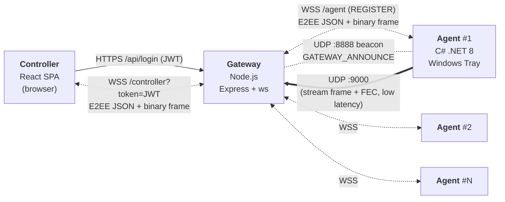

# Kiến trúc Hệ thống

> Tài liệu này mô tả **trạng thái hiện tại** của toàn bộ monorepo: cây thư mục, vai trò từng file, các store Zustand và action, luồng dữ liệu, danh sách message được hỗ trợ, tầng mã hoá đầu-cuối (E2EE), các module đã hoàn thiện và các quy ước đang được áp dụng. Cách chạy xem [`README.md`](README.md).

---

## 1. Tổng quan



- **Star topology** — Agent không nói chuyện trực tiếp với Controller; mọi traffic đi qua Gateway.
- **Cùng một WebSocket** vừa mang JSON control vừa mang binary frame (screen + webcam).
- **E2EE (Zero-Trust)** — Controller ⇄ Agent mã hoá đầu-cuối bằng ECDH P-256 + AES-256-GCM; Gateway chỉ relay ciphertext, **không đọc được** nội dung lệnh/response/frame.
- **UDP :9000** — Agent bắn frame stream nhanh về Gateway (kèm FEC parity) để giảm overhead WebSocket và chịu mất gói.
- **UDP :8888** — Gateway phát `GATEWAY_ANNOUNCE|wss://ip:port` mỗi 3 s; Agent lắng nghe để auto-discover Gateway trong LAN.
- **HTTPS/HTTP** — dùng cho REST `POST /api/login`, `POST /api/refresh`, `POST /api/logout`, `GET /health`, `GET /api/agents`.
- **TLS/WSS mặc định bật** (`TLS_ENABLED !== 'false'`); đặt `TLS_ENABLED=false` để chạy HTTP/WS chế độ dev.

---

## 2. Cây thư mục & vai trò từng file

### 2.1. Root
```
remote-computer-control/
├── Architecture.md            Tài liệu này
├── README.md                  Trang chủ monorepo (giới thiệu + link)
├── LICENSE
├── docs/                      Tài liệu chung
│   ├── protocol/              Schema canonical của mọi message JSON
│   ├── design/                Thiết kế chi tiết từng subsystem
│   ├── reports/               Báo cáo đánh giá
│   └── guide.md               Hướng dẫn tổng hợp
├── scripts/                   setup.ps1 (bootstrap 1 lệnh: sinh secret + cert + deps + seed),
│                              gen-cert.ps1 (tạo TLS cert, tự dò openssl), dev-up.ps1
├── controller/                React SPA — xem 2.2
├── gateway/                   Node.js relay — xem 2.3
└── agent/                     C# tray app — xem 2.4
```

### 2.2. Controller (`controller/`)
```
controller/
├── package.json               React 19 + Vite + Zustand 5 + lucide-react + recharts + oxlint
├── vite.config.js             Vite config, `VITE_USE_MOCK` env
├── index.html
└── src/
    ├── main.jsx               ReactDOM.createRoot, mount <App/>
    ├── App.jsx                Auth gate: token null → <LoginScreen>; có token → console shell
    ├── App.css / index.css    Theme tokens + global reset
    │
    ├── components/
    │   ├── FrameCanvas.jsx        Vẽ 1 frame (ArrayBuffer) lên <canvas>. Subscribe FrameEventBus theo (agent_id, module) — nhận frame trực tiếp KHÔNG qua React state. Hỗ trợ delta encoding: keyframe resize canvas + vẽ (0,0); non-keyframe vẽ diff-rect tại (meta.x, meta.y) không reset canvas.
    │   ├── E2EEUnlockModal.jsx    Modal nhập Master Password để mở khoá kho PIN; nhập/lưu PIN cho từng agent (dùng E2EEStore).
    │   ├── LoginScreen.jsx        Form đăng nhập, gọi AuthService, lưu JWT vào ConnectionStore (in-memory, KHÔNG sessionStorage).
    │   ├── ModuleTable.jsx        Bảng chung (sort/filter) dùng chung cho App/Process.
    │   ├── PermissionGate.jsx     HOC bọc mỗi module tab (view Focus). Expose useGuardedSend + usePendingConsent qua React context — click nút gọi guardedSend(fn), nếu chưa cấp thì queue + xin quyền.
    │   ├── MainArea.jsx           Router panel chính: theo active_tab + số agent đang chọn (online) → render module Grid (đa agent) hoặc FocusView (1 agent); đồng bộ focused_agent_id khi chọn đúng 1 agent.
    │   ├── ModuleTabs.jsx         Thanh 8 tab module, luôn hiển thị trên cả Grid lẫn Focus; click chỉ set active_tab (không tự đổi view).
    │   ├── agents/
    │   │   ├── AgentCard.jsx      Ô hiển thị 1 agent (tên, status, checkbox multi-select). Click thân card = chọn riêng agent này (→ view Focus); checkbox = multi-select cho lệnh/grid.
    │   │   ├── AgentList.jsx      Danh sách agent trong Sidebar, filter theo search query.
    │   │   └── MultiSelect.jsx    Thanh chọn tất cả / bỏ chọn agent online (nguồn selected_agent_ids).
    │   ├── layout/
    │   │   ├── Sidebar.jsx        Panel trái: logo, search, AgentList, gateway status.
    │   │   ├── TopBar.jsx         Header: breadcrumb (module + tên agent hoặc "— All Agents"), badge SENSITIVE, connection, theme toggle, logout. View grid/focus suy ra từ selection (services/viewMode).
    │   │   └── ThemeToggle.jsx    Nút đổi light/dark theme.
    │   ├── livescreen/
    │   │   └── FocusView.jsx      Panel 1 agent: chọn module component theo active_tab, bọc PermissionGate (trừ sysinfo), gate theo trạng thái E2EE của agent focus.
    │   ├── modulegrid/            Lưới đa agent — tile cho MỌI agent online; toolbar thao tác hàng loạt chỉ nhắm agent đang chọn.
    │   │   ├── ModuleGridShell.jsx  Khung chung: header + toolbar + lưới tile; tile highlight khi được chọn; click tile = toggle select.
    │   │   ├── SysInfoGrid.jsx      Tile CPU/RAM/Disk từng agent; poll sysinfo mọi agent online (không consent).
    │   │   ├── ScreenGrid.jsx       Tile stream 2 fps; chỉ agent đã cấp quyền screen mới auto-stream; toolbar View/Stop (agent đang chọn).
    │   │   ├── WebcamGrid.jsx       Tile webcam feed (fps thấp); toolbar Start/Stop (agent đang chọn).
    │   │   ├── KeylogGrid.jsx       Tile trạng thái + preview phím; toolbar Start/Stop (agent đang chọn).
    │   │   └── PowerGrid.jsx        Tile trạng thái quyền; toolbar Lock/Restart/Shutdown/Sleep (agent đang chọn) + countdown chung.
    │   └── modules/               Mỗi module 1 folder, chỉ có index.jsx — dùng cho view Focus (1 agent)
    │       ├── ApplicationTab/    List/start/stop app (whitelist). Poll 3 s (silent).
    │       ├── ProcessTab/        List/kill process. Poll 3 s (silent).
    │       ├── ScreenTab/         Screenshot + start/stop stream + toggle "Control" (Remote Input).
    │       ├── KeylogTab/         Terminal log, gộp ký tự liên tiếp thành 1 dòng, Enter ngắt dòng; export .txt.
    │       ├── FileTab/           Sandbox browser, upload/download chunked binary.
    │       ├── WebcamTab/         MJPEG stream, dùng FrameCanvas với label="WEBCAM".
    │       ├── SysInfoTab/        CPU/RAM/Disk/uptime realtime. Poll 3 s (silent).
    │       └── PowerTab/          lock / restart / shutdown / sleep + countdown UI.
    │
    ├── hooks/
    │   ├── UseAgentSocket.js      Singleton socket (refcount, ONE global connection). Public API: sendCommand, sendToFocused, sendToSelected, requestPermission, revokePermission, stopModule. Điều phối E2EE: bọc mọi lệnh gửi đi thành e2ee_payload, giải mã e2ee_payload nhận về, chạy handshake khi agent online, giải mã frame UDP bằng khoá phiên ổn định rồi emit sang FrameEventBus.
    │   └── useBatchGuardedSend.js Consent-trước-lệnh cho MỘT TẬP agent (grid đa agent): mỗi agent đã cấp → gửi ngay; chưa cấp → xin quyền + hàng đợi, agent nào cấp thì drain gửi; timeout 30 s. Tái dùng API của UseAgentSocket.
    │
    ├── services/
    │   ├── index.js               ONE place chọn mock vs real: `USE_MOCK = import.meta.env.VITE_USE_MOCK !== 'false'`.
    │   ├── Socket.js              Wrap trình duyệt WebSocket, callback onOpen/onMessage/onBinary/onClose/onError, gắn token vào query string.
    │   ├── MockSocket.js          Sim Gateway+Agent trong browser, đóng vai Agent của giao thức E2EE THẬT: handshake ECDH/HMAC bằng utils/crypto (khoá khớp tuyệt đối controller), giải mã e2ee_payload để đọc lệnh, trả permission_result (agent-06 từ chối consent), mã hoá frame screen/webcam bằng khoá UDP phiên. Kết quả module trả plaintext.
    │   ├── FrameEventBus.js       EventTarget nhẹ; kênh phát frame ảnh theo tên "frame_{agentId}_{module}" để FrameCanvas nhận trực tiếp, tránh re-render toàn cây React.
    │   ├── Protocol.js            Builders (buildXxx), validators, MSG_TYPE, MODULE, FEATURE, POWER_ACTION, normalizeIncoming (chuẩn hoá snake_case tên field).
    │   ├── viewMode.js            GRID_MODULES + deriveViewMode(active_tab, số agent online đang chọn) → 'grid' | 'focus'; nguồn quy tắc dùng chung cho MainArea + TopBar.
    │   └── AuthService.js         POST /api/login, /api/refresh, /api/logout; xử lý refresh cookie.
    │
    ├── utils/
    │   └── crypto.js              WebCrypto helper cho E2EE: sinh cặp ECDH P-256, export/import SPKI, HMAC-SHA256 (ký PIN), HKDF-SHA256 (dẫn xuất khoá phiên TCP + UDP), AES-256-GCM encrypt/decrypt, tiện ích Base64/ArrayBuffer.
    │
    └── store/                     Zustand — xem 4.1
```

### 2.3. Gateway (`gateway/`)
```
gateway/
├── package.json               Express 5 + ws + better-sqlite3 + bcryptjs + jsonwebtoken + AJV + winston + express-rate-limit + cookie-parser + cors
├── nodemon.json               Dev auto-reload
├── certs/                     server.cert + server.key (self-signed, KHÔNG commit — gitignore)
└── src/
    ├── index.js               Boot: init DB, start server.
    ├── server.js              1 HTTP(S) server + WebSocketServer(noServer:true). Tự chọn HTTPS/WSS khi tlsEnabled. CORS whitelist + rate-limit /api/login (10/60s). Route upgrade theo pathname (/agent, /controller). Khởi động UDP :9000 + beacon :8888.
    ├── config.js              Read .env: port, CONTROLLER_KEY (bắt buộc — thiếu thì thoát), AGENT_KEY, JWT secret, allowedOrigins, tlsEnabled/tlsCertPath/tlsKeyPath, rate-limit. Validate lúc load.
    ├── db.js                  better-sqlite3 handle + prepared statements (getUserByUsername, getUserById, refresh_tokens CRUD, agent CRUD).
    │
    ├── auth/
    │   └── login.js           POST /api/login (bcrypt verify SQLite, phát JWT + refresh cookie HttpOnly), /api/refresh, /api/logout.
    ├── middleware/
    │   └── auth.js            Verify Bearer JWT (REST) + verify JWT trong WS upgrade query (?token=).
    ├── router/
    │   └── messageRouter.js   Đọc target_agents, forward raw tới agent. Broadcast (target_agents rỗng) CHỈ cho policy_update; type khác thiếu target_agents bị reject.
    ├── socket/
    │   ├── agentHandler.js    /agent — xác thực bằng REGISTER message { agent_id, secret }; register vào agentStore; stamp agent_id rồi relay message ngược lên controllerStore (theo command_id hoặc subscriber).
    │   └── controllerHandler.js  /controller?token=JWT — verify JWT, register vào controllerStore, whitelist type (bao gồm e2ee_init/e2ee_payload) rồi route qua messageRouter.
    ├── store/
    │   ├── agentStore.js      Map<agent_id, ws> (in-RAM) + metadata agent.
    │   ├── controllerStore.js Set<ws> + subscribe/command-initiator map (in-RAM).
    │   ├── heartbeat.js       Ping loop ~30 s, đóng socket im lặng khi mất nhịp.
    │   ├── data.sqlite        Persistence chính (users, agents, refresh_tokens).
    │   ├── users.json         Seed cho migration ban đầu.
    │   └── agents.json        Seed cho migration ban đầu.
    ├── udp/
    │   ├── udpServer.js       :9000 nhận stream frame + parity từ Agent; gom chunk theo frameId; khôi phục 1 chunk mất bằng FEC XOR; forward frame_meta (JSON) + payload (binary) tới controller.
    │   ├── fecWorker.js       Worker Thread: tính XOR khôi phục chunk mất (offload khỏi event loop chính).
    │   └── beacon.js          Broadcast `GATEWAY_ANNOUNCE|wss|ws://ip:port` trên UDP :8888 mỗi 3 s.
    ├── utils/
    │   └── logger.js          Winston rolling: gateway.log + error.log.
    └── validation/
        └── commandSchemas.js  AJV schema per module để validate params trước khi forward.
```

### 2.4. Agent (`agent/`)
```
agent/
├── agent.csproj / agent.sln   .NET 8 Windows Forms
├── app.manifest               Cấu hình UIPI (uiAccess) cho tương tác input đặc quyền.
├── Program.cs                 [STAThread] Main: ConfigManager → nếu gateway_url rỗng thử NetworkDiscovery.ScanForGatewayAsync (UDP :8888), fallback GatewayConfigForm → DI container → đăng ký module → Application.Run(TrayApp).
├── config.example.json        Template config (committed). Copy → config.json và điền secret.
├── config.json                Runtime, GITIGNORE. agent_id, gateway_url, auth_key, e2ee_shared_secret (PIN), app_whitelist, sandbox_root_path, log_retention_days, consent_timeout_ms, tray_password.
│
├── Core/
│   ├── AgentClient.cs             Chủ ClientWebSocket + SemaphoreSlim send lock. Giữ CryptoModule; xử lý e2ee_init (verify HMAC PIN → derive khoá → trả e2ee_ready); chặn mọi lệnh khi E2EE chưa sẵn sàng (trừ policy_update/permissions_reset/e2ee_init); bọc response gửi đi thành e2ee_payload. Route command theo _moduleRegistry.
│   ├── IAgentContext.cs           Interface expose AgentId + SendResponse + Crypto cho module.
│   ├── MessageDispatcher.cs       Deserialise JSON → CommandPacket; giải mã e2ee_payload (kiểm sequence window chống replay) → RouteCommand.
│   └── WebSocketClient.cs         Low-level wrap ClientWebSocket, reconnect + heartbeat.
│
├── Managers/
│   ├── UIManager.cs               Consent popup (TCS-based, hard timeout, enum ConsentOutcome Granted/Declined/Timeout/Busy). Overlay red-dot (webcam) + blue "K" (Remote Input). ShowCountdown.
│   ├── SecurityManager.cs         App whitelist + sandbox path normalization (chống `..`) + consent gate.
│   ├── ConfigManager.cs           Load/save config.json; expose GatewayUrl, E2EESharedSecret, …
│   ├── AuditLogger.cs             Log mọi permission_request/revoke + command đã thực thi.
│   └── LogCleanupJob.cs           Timer xoá log Serilog cũ hơn log_retention_days.
│
├── Modules/                       Đều kế thừa BaseModule (IAgentContext + SecurityManager + UIManager).
│   ├── BaseModule.cs              abstract: SupportedCommands, ExecuteAsync, virtual OnDisconnected.
│   ├── CryptoModule.cs            E2EE crypto: ECDH P-256, HMAC-SHA256 (xác thực PIN), HKDF-SHA256 (khoá TCP "RemoteControl_E2EE_v1" + khoá UDP "RemoteControl_UDP_v1"), AES-256-GCM (TCP payload + UDP frame với AAD = frameId + timestamp), sequence window chống replay; khoá UDP ổn định theo phiên (không ratchet).
│   ├── AppModule.cs               app_list / app_start / app_stop (chỉ chạy app trong whitelist).
│   ├── ProcessModule.cs           proc_list (pid/name/cpu%/ram — không tra owner) / proc_kill (tra owner để chặn kill tiến trình lõi hệ thống + đặc quyền).
│   ├── KeyloggerModule.cs         keylog_start/stop + global low-level keyboard hook; batch qua ConcurrentQueue (lock-free) rồi flush theo PeriodicTimer.
│   ├── WebcamModule.cs            webcam_start/stop, MJPEG, red-dot overlay khi bật; bắn frame qua UdpStreamSender.
│   ├── FileModule.cs              fs_list / fs_get / fs_put — chunk, sha256 verify, sandbox root. HandleBinaryChunk cho upload.
│   ├── StreamModule.cs            screenshot + screen_stream/stop. Change detection + Bounding-Box Delta Encoding (LockBits unsafe). Keyframe định kỳ. Bắn frame qua UdpStreamSender.
│   ├── PowerModule.cs             lock / restart / shutdown / sleep (Win32 Shutdown API).
│   ├── SysInfoModule.cs           sysinfo — CPU/RAM/Disk/uptime/hostname/IP/OS.
│   └── InputModule.cs             input_mouse_move (fire-and-forget) / input_mouse_click / input_key / input_type qua SendInput. Overlay blue "K".
│
├── Forms/
│   ├── TrayApp.cs                 NotifyIcon + context menu (Reconfigure / Reset / Exit — có tray_password).
│   ├── MainForm.cs               Cửa sổ trạng thái/log agent.
│   ├── GatewayConfigForm.cs       Dialog nhập gateway_url + auth_key khi config trống / discovery thất bại.
│   └── PasswordPromptForm.cs      Prompt tray_password trước action nhạy cảm ở tray.
│
├── Models/
│   ├── AppConfig.cs               POCO map config.json.
│   └── CommandPacket.cs           POCO message inbound (type, command_id, module, feature, params, target_agents, publicKey, signature, seq, data).
│
├── Utils/
│   ├── ImageUtils.cs              Bitmap → JPEG, LockBits helper cho diff detection.
│   ├── NetworkDiscovery.cs        ScanForGatewayAsync: lắng nghe UDP :8888, parse GATEWAY_ANNOUNCE để tự tìm Gateway.
│   └── UdpStreamSender.cs         Chunk frame → UDP :9000; mã hoá E2EE (AAD = frameId + timestamp) khi sẵn sàng; sinh FEC parity chunk cho frame nhiều mảnh.
│
└── Logs/                          Serilog rolling daily (auto-clean).
```

---

## 3. Giao thức (Protocol)

Schema canonical: [`docs/protocol/*.json`](docs/protocol/) + [`Instruction.md`](docs/protocol/Instruction.md).

### 3.1. Ba lớp message

| Lớp | Chiều | Đặc trưng | Ví dụ |
|---|---|---|---|
| **request** | Controller → Gateway → Agent | Có `command_id`, `module`, `params`, `target_agents`. Gateway forward raw. | `{type:"request", command_id, module:"sysinfo", params:{}, target_agents:["PC-01"]}` |
| **response** | Agent → Gateway → Controller | Suffix `_result` / `_error` / `_denied`. Gateway stamp `agent_id`. | `sysinfo_result`, `fs_put_complete`, `keylog_denied`, `power_result`, `input_result` |
| **event** | Không solicited | Không có `command_id`. | `agents_list`, `agent_status`, `frame_meta` (+ binary), `keylog`, `auth_expired`, `permissions_reset` |

Khi E2EE bật, mọi message của 3 lớp trên (trừ khối handshake) được **bọc trong `e2ee_payload`** trước khi qua Gateway.

### 3.2. Danh sách message hiện được hỗ trợ

**TX (Controller → Gateway):** `list_agents`, `request`, `power`, `policy_update`, `permission_request`, `permission_revoke`, `stop_module`, `subscribe`, `unsubscribe`, `e2ee_init`, `e2ee_payload`.

**RX (Gateway/Agent → Controller):**

| Nhóm | Message types |
|---|---|
| Agent status | `agents_list`, `agent_status` |
| Application | `app_list_result`, `app_action_result` |
| Process | `proc_list_result`, `proc_kill_result` |
| Screen | `frame_meta` (+ binary frame), `stream_started`, `stream_stopped` |
| Keylog | `keylog`, `keylog_started`, `keylog_stopped`, `keylog_denied` |
| Webcam | `frame_meta` (+ binary frame), `webcam_started`, `webcam_stopped`, `webcam_denied` |
| File | `fs_list_result`, `fs_get_result` (+ binary chunk), `fs_put_result`, `fs_put_complete`, `fs_action_result`, `fs_error` |
| Power | `power_result` |
| SysInfo | `sysinfo_result` |
| Remote Input | `input_started`, `input_stopped`, `input_denied` (`reason` ∈ `"user declined" \| "timeout" \| "busy"`), `input_result` |
| Policy | `policy_update_result` |
| Permission | `permission_result`, `permissions_reset` |
| E2EE | `e2ee_ready`, `e2ee_error`, `e2ee_payload` |
| Auth | `auth_expired` |

### 3.3. `feature` vs `module`

- **feature** = permission group (đơn vị consent) — dùng trong `permission_request/revoke`. Giá trị: `application`, `process`, `screen`, `keylog`, `file`, `webcam`, `power`, `input`.
- **module** = command namespace (đơn vị lệnh) — dùng trong `request.module`: `app_list/start/stop`, `proc_list/kill`, `screenshot`, `screen_stream`, `screen_stream_stop`, `keylog_start/stop`, `webcam_start/stop`, `fs_list/get/put/delete`, `sysinfo`, `input_mouse_move/click`, `input_key`, `input_type`.

**Remote Input** dùng feature riêng `"input"` (KHÔNG dùng chung với `"screen"`).

### 3.4. Binary frame — pairing pattern

Hai kênh binary trên cùng một WS:

1. **Frame ảnh (screen / webcam)** — cặp `frame_meta` JSON + binary kế tiếp. Controller pair theo **thứ tự nhận**.
2. **File chunk (`fs_get_result`)** — cặp `fs_get_result` JSON (chứa `transfer_id` **bắt buộc**) + binary bytes kế tiếp. Controller pair theo `transfer_id` (Map) — hỗ trợ nhiều download song song.

### 3.5. Đường đi frame UDP (screen / webcam)

1. Agent chụp/encode frame → (nếu E2EE sẵn sàng) mã hoá AES-256-GCM bằng khoá UDP, AAD = `frameId(2) + timestamp(8)`.
2. Chia thành chunk ≤ 1300 byte; header UDP 24 byte cố định + agent_id/command_id. Frame nhiều chunk kèm **1 parity chunk** (index = totalChunks) = XOR toàn bộ chunk.
3. Gateway (`udpServer.js`) gom chunk theo `frameKey`; đủ chunk → ghép; thiếu đúng 1 chunk + có parity → **fecWorker** khôi phục bằng XOR; timeout 40 ms; GC frame dở sau 100 ms.
4. Gateway forward `frame_meta` (JSON) + payload (binary) tới controller.
5. Controller giải mã (nếu E2EE) bằng khoá UDP phiên (IV 12 byte + AAD frameId/timestamp), rồi **emit sang FrameEventBus** để FrameCanvas vẽ.

**Delta encoding:** `frame_meta` screen mang `is_keyframe`, `x/y/w/h`. Keyframe = full frame (resize canvas, vẽ (0,0)); non-keyframe = diff-rect vẽ tại (x,y). Agent chèn keyframe định kỳ để tránh drift.

### 3.6. E2EE — handshake & mã hoá

- **Master Password (Controller):** mở khoá kho PIN cục bộ (IndexedDB) qua PBKDF2 (600k vòng) + AES-GCM. Mỗi agent có 1 PIN chia sẻ trước (khớp `e2ee_shared_secret` phía Agent).
- **Handshake (xác thực bằng PIN, chống MitM):**
  1. Controller → `e2ee_init { publicKey (SPKI), signature = HMAC-SHA256(publicKey, PIN) }`.
  2. Agent verify HMAC → ECDH P-256 (raw secret) → HKDF-SHA256 dẫn xuất khoá TCP + UDP → Controller nhận `e2ee_ready { publicKey, signature }` → verify HMAC → dẫn xuất cùng khoá. Từ chối → `e2ee_error`.
- **Kênh TCP (WS JSON):** mọi lệnh/response bọc `e2ee_payload { agent_id, seq, data = base64(iv[12] + ciphertext + tag[16]) }`, AES-256-GCM; **sequence sliding window (size 5)** chống replay.
- **Kênh UDP (frame):** mã hoá AES-256-GCM bằng **khoá UDP ổn định theo phiên** (dẫn xuất một lần khi handshake, không ratchet), AAD = `frameId(2) + timestamp(8)`; mỗi frame dùng IV ngẫu nhiên 12 byte.
- **Gateway:** chỉ relay `e2ee_init`/`e2ee_payload`, **không giữ khoá, không đọc plaintext**.
- **Re-handshake:** khi agent reconnect / `permissions_reset`, hai bên reset sequence và bắt tay lại.

---

## 4. Controller — chi tiết

### 4.1. Zustand stores (7)

| Store | State | Actions |
|---|---|---|
| **AgentStore** | `agents[]`, `focused_agent_id`, `selected_agent_ids[]`, `search_query` | `setAgents`, `setAgentStatus(id, patch)`, `setFocused(id)`, `toggleSelect(id)`, `setSelectedIds(ids)`, `clearSelection`, `setSearchQuery`, getters `getFilteredAgents`, `getFocusedAgent` |
| **ConnectionStore** | `status: 'idle'\|'connecting'\|'open'\|'closed'`, `gateway_url`, `auth_token` | `connect(url)`, `disconnect`, `setStatus`, `setGatewayUrl`, `setAuthToken`, `clearAuthToken` |
| **ModuleStore** | `data[agent_id][module]`; mỗi agent: `app[]`, `process[]`, `keylog[]`, `keylog_active`, `screen{frame,meta}`, `webcam{frame,meta}`, `webcam_active`, `screen_stream_active`, `input_active`, `file{tree,path}`, `file_downloads[transfer_id]`, `file_put_ack`, `sysinfo`, `sysinfo_history[]`. Chỉ `frame_meta` được ghi vào slot screen/webcam; **buffer frame ảnh đi qua FrameEventBus, không vào store**. | `setModuleData`, `appendKeylog`, `appendSysInfo`, `setScreenStreamActive`, `setWebcamActive`, `setKeylogActive`, `setInputActive`, `setFsEntries`, `appendFileDownloadChunk`, `removeFileDownload`, `setFilePutAck`, `clearFilePutAck`, `clearModule`, `clearAgent`, `clearLiveFlagsForAgent`, `clearAllLiveFlags` |
| **PermissionStore** | `permissions[agent_id][feature] = 'idle'\|'requesting'\|'granted'\|'denied'` | `requestPermission(id, feature)`, `setPermissionResult(id, feature, granted)`, `revoke(id, feature)`, `revokeAll(id)`, getter `getStatus(id, feature)` |
| **PolicyStore** | `app_whitelist[]`, `sandbox_path`, `results[agent_id] = { success, message }` | `setWhitelist`, `setSandboxPath`, `setPolicyResult(id, result)` |
| **UiStore** | `theme`, `active_tab` (mặc định `sysinfo`), `layout_mode` (legacy — view grid/focus thực tế suy ra từ selection qua `services/viewMode`), `sidebar_open`, `toasts[]` | `setTheme`, `toggleTheme`, `setLayoutMode`, `setActiveTab`, `toggleSidebar`, `addToast(msg, variant)`, `dismissToast(id)` |
| **E2EEStore** | `isUnlocked`, `masterKey`, `sessions[agent_id] = { state, sessionKey, udpKeyBuffer, udpFrameIdOffset, udpLastSeq, sendSeq, recvSeq }` | `unlock/lock`, `saveAgentPin/getAgentPin` (IndexedDB), `setSessionState`, `resetSession`, `getSessionKey`, `getSendSeqAndIncrement`, `checkAndUpdateRecvSeq`, `updateUdpSeq` |

Mọi component subscribe **selector cụ thể** (`useStore(s => s.x)`).

### 4.2. Luồng dữ liệu: `component → hook → service → store`

**Outbound** (UI action → wire):
```
Component (onClick)
   → useGuardedSend()(fn)  ── PermissionGate: kiểm consent, queue nếu chưa cấp
       → useAgentSocket().sendCommand / sendToFocused / sendToSelected
           → services/Protocol.buildXxx()          ── build JSON đúng schema
           → (E2EE) bọc thành e2ee_payload + AES-GCM + seq
           → services/index.js (AgentSocket) → socket.send()
```

**Inbound** (wire → UI):
```
AgentSocket.onMessage(raw)
   → nếu e2ee_payload → giải mã + kiểm sequence → JSON gốc
   → normalizeIncoming → UseAgentSocket.dispatchMessage
       → switch(type) → useModuleStore / usePermissionStore / useE2EEStore / …

Binary frame:
AgentSocket.onBinary(bytes)
   → nếu _pending_fs_chunks (fs_get_result chờ) → pair theo transfer_id → appendFileDownloadChunk
   → nếu _pending_meta (frame_meta) → (E2EE) giải mã bằng khoá UDP phiên → FrameEventBus.emit(agent_id, module, frame, meta)
       → FrameCanvas (đã subscribe) vẽ canvas trực tiếp
   → ngược lại drop + warn
```

### 4.3. Pattern Mock ↔ Real socket

- `services/index.js` là **nơi DUY NHẤT** đọc `VITE_USE_MOCK`. `Socket.js` (real) và `MockSocket.js` cùng API shape (`connect/close/send`, `onOpen/onMessage/onBinary/onClose/onError`). Toàn app import `AgentSocket from '../services'`. Đổi backend chỉ cần set `VITE_USE_MOCK=false`.
- `MockSocket.js` chạy đúng luồng E2EE thật của controller (handshake + giải mã lệnh + mã hoá frame). Vì vậy khi dùng mock vẫn phải **nhập Master Password** trong `E2EEUnlockModal` để kích hoạt handshake (dùng PIN mặc định `default-pin-12345`); trước khi handshake, mọi lệnh module bị chặn — đúng như với Agent thật.

### 4.4. Consent flow

**Focus (1 agent) — PermissionGate:** 1. Component gọi `guardedSend(fn)`. 2. Nếu feature đã `granted` → chạy ngay. 3. Ngược lại: queue `fn`, `requestPermission`, hiện spinner. 4. Agent trả `permission_result` → drain queue khi granted, toast lỗi khi denied. 5. Timeout 30 s → toast + clear queue. 6. Rời tab / đổi agent → auto `revokePermission` + `stopModule`.

**Grid (đa agent) — useBatchGuardedSend:** với TỪNG agent đang chọn: đã `granted` → gửi lệnh ngay; chưa → xin quyền + hàng đợi, `permission_result` granted thì drain gửi, denied/timeout thì bỏ. Mỗi agent tự bung popup riêng (N agent = N popup).

### 4.5. View routing & Grid đa agent

- `components/MainArea.jsx` chọn view qua `services/viewMode.deriveViewMode(active_tab, số_agent_online_đang_chọn)`:
  - Module **grid-capable** (`sysinfo`, `keylog`, `webcam`, `power`, `screen`): chọn đúng **1** agent → **Focus** agent đó; chọn **0 hoặc ≥2** → **Grid** (hiện MỌI agent online).
  - Module còn lại (`file`, `application`, `process`): **luôn Focus**.
- `ModuleTabs.jsx` (thanh tab) luôn hiển thị ở cả hai view; đổi tab chỉ set `active_tab`.
- **Grid** (`components/modulegrid/`): tile cho từng agent online, tile "Not authorized" nếu agent chưa cấp feature tương ứng; **toolbar thao tác hàng loạt chỉ nhắm `selected_agent_ids`** (chưa chọn agent nào → nút disabled). Consent hàng loạt qua `hooks/useBatchGuardedSend.js`.

---

## 5. Modules — trạng thái hoàn thiện

| Module | Feature | Command | Consent | Đã có |
|---|---|---|---|---|
| **Application** | `application` | `app_list`, `app_start`, `app_stop` | ✓ | List whitelist, start/stop, poll 3 s silent. |
| **Process** | `process` | `proc_list`, `proc_kill` | ✓ | List/kill PID (chặn tiến trình lõi + đặc quyền), poll 3 s silent. |
| **SysInfo** | (none) | `sysinfo` | — | CPU/RAM/Disk/uptime/hostname/IP/OS, poll 3 s, recharts sparkline. |
| **Screen** | `screen` | `screenshot`, `screen_stream`, `screen_stream_stop` | ✓ | 1-shot + live stream (delta encoding, keyframe định kỳ, FEC, E2EE UDP), countdown trước khi bật. |
| **Remote Input** | `input` | `input_mouse_move/click`, `input_key`, `input_type` | ✓ (riêng) | Nút "Control" trên ScreenTab, overlay blue "K", remap toạ độ, throttle mouse_move. |
| **Keylog** | `keylog` | `keylog_start`, `keylog_stop` | ✓ | Hook lock-free, terminal log gộp dòng, export .txt. |
| **Webcam** | `webcam` | `webcam_start`, `webcam_stop` | ✓ | MJPEG stream (FEC, E2EE UDP) + red-dot overlay Agent. |
| **File** | `file` | `fs_list`, `fs_get`, `fs_put`, `fs_delete` | ✓ | Sandbox browser, chunk + sha256, download song song, upload binary. |
| **Power** | `power` | `power` (lock/restart/shutdown/sleep) | ✓ | Countdown ở Controller trước khi bắn lệnh. |
| **Policy** | — | `policy_update` | — (broadcast) | Push `app_whitelist` + `sandbox_path` fleet-wide (type DUY NHẤT được broadcast). |

---

## 6. Quy ước (Conventions)

### 6.1. Common (MỌI subsystem — agent + gateway + controller + docs)

- **Braces Allman**: `{` mở trên **dòng riêng**, thẳng cột với statement mở khối.
- **Comment tiếng Anh**, từ đơn giản, giải thích **WHY** (invariant, workaround, ràng buộc), không WHAT. Trailing `//` liền kề **căn thẳng 1 cột**.
- **Constant thực sự**: `UPPER_SNAKE_CASE` mọi ngôn ngữ.
- **Import / using** theo cụm: stdlib → third-party → local, cách nhau 1 dòng trống.
- **KHÔNG hardcode** màu / font-size / spacing / port / path / key / timeout — luôn qua CSS var / config / env / const.
- **JSON schema (`docs/protocol/`)** là **single source of truth**; field name `snake_case`. Drift ở code phải sync lại schema trước khi merge.
- **`Architecture.md`** luôn phản ánh **TRẠNG THÁI HIỆN TẠI** — không changelog, không "đổi từ X sang Y".

### 6.2. Controller — JavaScript / JSX

- **Naming**: biến `snake_case`, hàm `camelCase`, class/component/enum `PascalCase`, constant `UPPER_SNAKE_CASE`, file `PascalCase.jsx|js`.
- **State**: chỉ **Zustand**; subscribe đúng slice; setter luôn spread giữ immutability.
- **Component** không gọi socket/fetch trực tiếp — chỉ qua `services/*` + `hooks/UseAgentSocket.js`. Frame ảnh đi qua **FrameEventBus**, không nhồi vào store.
- **Cleanup mọi `useEffect`**: interval, listener, WS handler, unsubscribe FrameEventBus, `URL.revokeObjectURL`, `ImageBitmap.close()`.
- **UI copy** cho operator: tiếng **Anh** — mọi chuỗi hiển thị (label, nút, toast, `title`, placeholder, breadcrumb) đều English; comment code cũng tiếng Anh.
- **Lint** `oxlint`: giữ pass.

### 6.3. Gateway — JavaScript (Node.js)

- **Naming**: biến `snake_case`, hàm `camelCase`, class `PascalCase`, constant `UPPER_SNAKE_CASE`. File `camelCase.js` (di sản, không mass-rename).
- **`const`** cho giá trị không reassign; `async/await` + try/catch quanh I/O.
- **Validation**: command JSON qua `messageRouter` phải whitelist type; params nhạy cảm validate AJV.
- **Không log** payload chứa credential/token.
- **State** chỉ ở SQLite (`db.js` prepared statements) + Map/Set in-RAM (`store/*.js`).

### 6.4. Agent — C# .NET 8

- **Naming .NET**: class/method/property/public field `PascalCase`; private field `_camelCase`; local/param `camelCase`; interface `IPascalCase`; enum `PascalCase`; const `UPPER_SNAKE_CASE`.
- **Async** `Task` + `PeriodicTimer` (không `Thread.Sleep` trong vòng lặp); critical section async → `SemaphoreSlim`.
- **Resource** `using`/`IDisposable` cho Bitmap, WebSocket, PerformanceCounter, CancellationTokenSource, `AesGcm`.
- **P/Invoke** khu trú ở `InputModule`, `KeyloggerModule`, `Utils/*`; signature khớp Win32, comment WHY.
- **DI**: Managers Singleton, Modules Transient (`Program.cs`).
- **Logging** Serilog rolling; không log secret / khoá.

### 6.5. E2EE / Crypto (cross-cutting)

- Tham số phải **khớp tuyệt đối** hai phía: ECDH **P-256**, HKDF-SHA256 với `info` `"RemoteControl_E2EE_v1"` (TCP) / `"RemoteControl_UDP_v1"` (UDP), salt rỗng; AES-256-GCM IV 12 byte + tag 16 byte; khoá UDP dẫn xuất một lần theo phiên (không ratchet), AAD UDP = `frameId(2) + timestamp(8)` khớp cả hai phía.
- Handshake xác thực bằng **HMAC-SHA256(publicKey, PIN)** — không bỏ verify.
- Gateway **không bao giờ** giữ khoá / đọc plaintext. PIN/khoá không log, không đưa vào URL.
- Khoá phiên xoá (zeroize) khi Dispose/Reset.

### 6.6. Auth & transport

- JWT access lưu **in-memory** (Zustand `ConnectionStore`, KHÔNG `sessionStorage`/`localStorage`) — reload trang = đăng xuất; refresh_token cookie HttpOnly re-hydrate token qua `AuthService.refreshAccessToken`. Gateway verify JWT ở WS `?token=`.
- **RBAC**: JWT mang `role`; `messageRouter` chỉ forward lệnh khi `role === 'admin'`. `role === 'viewer'` là read-only (xem danh sách agent + nhận stream qua subscribe, KHÔNG ra lệnh xuống agent).
- Agent xác thực qua **REGISTER message** `{ agent_id, secret }` sau khi mở WS `/agent`.
- **WSS/TLS mặc định**; cert local để trong `gateway/certs/` và **không commit**.

### 6.7. Sandbox, whitelist, consent, broadcast

- File: mọi `fs_*` hard-lock trong `sandbox_root_path`, normalize chống `..`.
- Application: chỉ app trong `app_whitelist` được `app_start`; push nóng qua `policy_update`.
- Consent timeout 30 s; popup đang mở → request mới cùng feature auto-reject (`Busy`); reset quyền khi disconnect.
- `messageRouter` chỉ cho `target_agents` rỗng khi `type === 'policy_update'`.

---

## 7. Persistence

| Thành phần | Nơi lưu | Nội dung |
|---|---|---|
| Gateway — SQLite | `gateway/src/store/data.sqlite` | `users` (username, password_hash bcrypt, role), `agents` (agent_id, secret_hash, display_name), `refresh_tokens`. |
| Gateway — seed | `store/users.json`, `store/agents.json` | Rỗng `[]`; chỉ cho migrate_from_json.js. Runtime không đọc, không ship credential. Admin seed qua `scripts/setup.ps1` (bcrypt vào SQLite). |
| Gateway — in-RAM | `Map<agent_id, ws>` + `Set<controller_ws>` | Session, xoá khi restart. |
| Gateway — logs | `logs/gateway.log`, `logs/error.log` | Winston rolling. |
| Gateway — certs | `gateway/certs/server.key|.cert` | Self-signed TLS, gitignore. |
| Agent — config | `agent/config.json` | agent_id, gateway_url, auth_key, e2ee_shared_secret, app_whitelist, sandbox_root_path, … |
| Agent — audit log | `agent/Logs/agent-YYYYMMDD.log` | Serilog rolling daily, auto-clean. |
| Controller — PIN vault | IndexedDB `RemoteControl_E2EE` | PIN từng agent, mã hoá AES-GCM dưới Master Password (PBKDF2). |
| Controller — session | JWT in-memory (Zustand `ConnectionStore`) + refresh cookie HttpOnly | Reload = đăng xuất (refresh cookie re-hydrate). Zustand + khoá phiên E2EE hoàn toàn in-memory. |

---

## 8. Mô hình bảo mật & secret

### 8.1. Bốn secret dùng chung

| Secret | Nằm ở | Vai trò |
|---|---|---|
| `CONTROLLER_KEY` | `gateway/.env` + `controller/.env` | Xác thực Controller ↔ Gateway |
| `AGENT_KEY` | `gateway/.env` + Agent `config.json` (`auth_key`) | Enroll agent (trust-on-first-use) |
| `JWT_SECRET` | **chỉ** `gateway/.env` | Ký JWT đăng nhập Controller |
| E2EE PIN | Agent `config.json` (`e2ee_shared_secret`) + gõ trên Controller | Mở khoá kênh end-to-end |

`scripts/setup.ps1` sinh cả 4 **một lần** và ghi khớp vào 3 nơi nên không bao giờ lệch. Auth agent là **theo từng agent**: mỗi agent có `secret_hash` bcrypt riêng trong SQLite; agent_id lạ mà `auth_key == AGENT_KEY` sẽ tự enroll lần đầu rồi ghim vào secret đó. Muốn chặt hơn: `node gateway/scripts/add_agent.js <id>` để cấp secret riêng.

### 8.2. Clone monorepo có mất an toàn không?

**Không — clone mới không mang theo secret sống nào.** Mọi secret đều gitignore và sinh cục bộ, **không commit**:

- `gateway/.env`, `controller/.env` (cả 4 secret)
- `gateway/certs/server.key|.cert` (khoá riêng TLS)
- `gateway/src/store/data.sqlite` (hash mật khẩu + hash secret agent)
- Agent `config.json` / `config.local.json` (auth_key, PIN)

Người vai trò Agent đọc được toàn bộ source (bình thường — code của nhóm) nhưng **không có credential** để giả mạo Gateway, forge login, hay giải mã E2EE của agent khác. Hai lưu ý: (1) **git history** từng chứa `server.key`/`data.sqlite` cũ — rủi ro thấp (cert self-signed localhost vứt đi, DB cũ chưa có credential thật) và setup tái tạo bản mới làm bản cũ vô dụng; xoá hẳn bằng `git filter-repo --invert-paths` nếu cần (đổi mọi commit hash). (2) **Least privilege**: máy agent chỉ cần `AGENT_KEY` + PIN + gateway URL — `setup.ps1 -Component agent` chỉ ghi đúng phần đó.

### 8.3. Bảo vệ at-rest

- Agent mã hoá PIN bằng **DPAPI** (`ConfigManager`) trước khi lưu `config.json`.
- Controller cất PIN từng agent trong **IndexedDB** mã hoá AES-GCM dưới Master Password (PBKDF2); khoá phiên E2EE hoàn toàn in-memory.
- Mật khẩu login lưu **bcrypt**; JWT access 30m + refresh 7d (cookie HttpOnly).

---

## 9. Nơi tra cứu

- Schema JSON: [`docs/protocol/`](docs/protocol/) — nguồn duy nhất cho tên field.
- Thiết kế Controller: [`docs/design/controller/architecture.md`](docs/design/controller/architecture.md).
- Thiết kế Gateway: [`docs/design/gateway/technical_design.md`](docs/design/gateway/technical_design.md).
- Thiết kế Agent: [`docs/design/agent/technical_design.md`](docs/design/agent/technical_design.md).
- Đánh giá & bug còn mở: [`docs/reports/evaluation.md`](docs/reports/evaluation.md).
