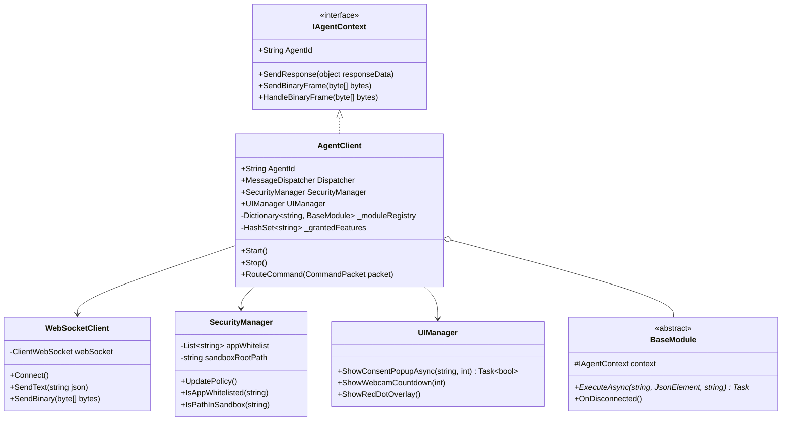
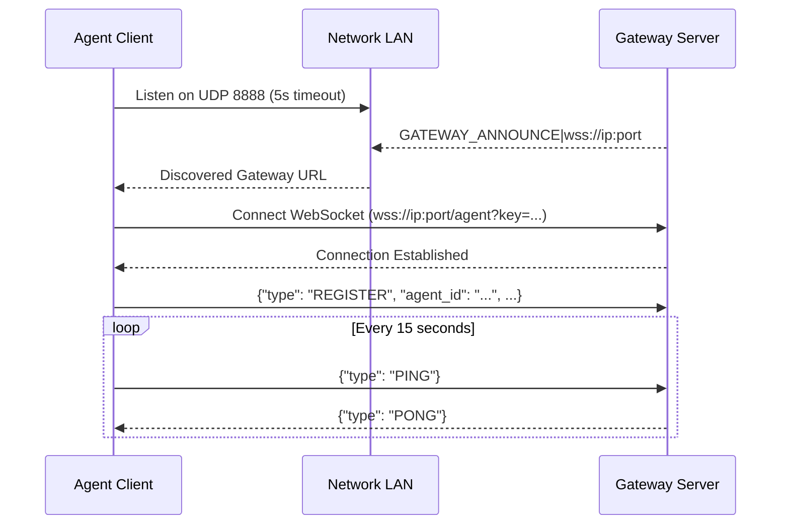
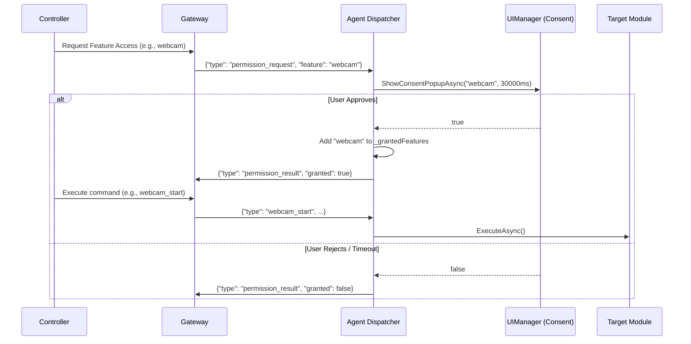
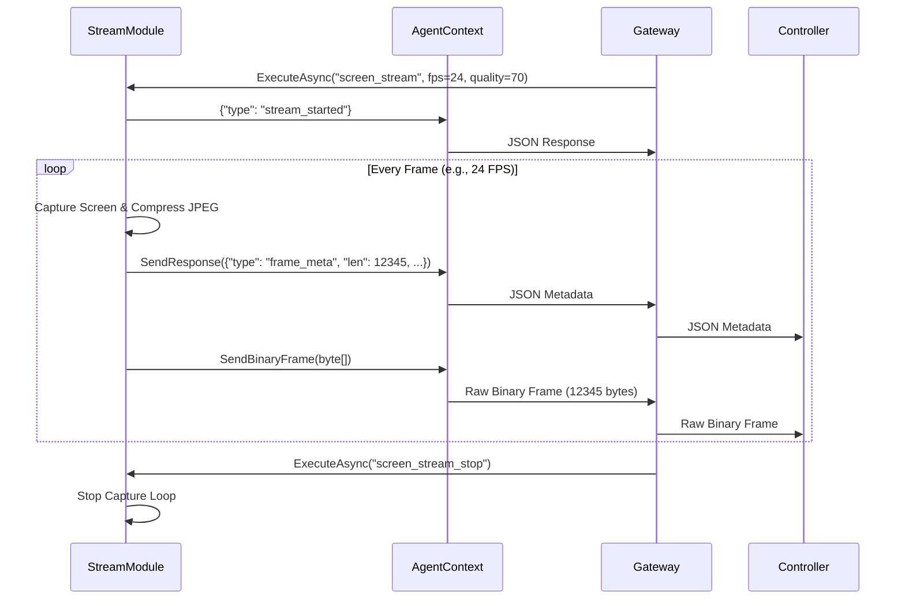
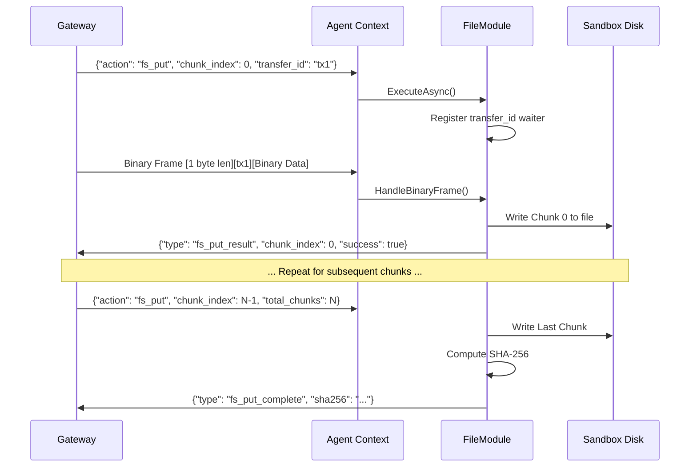

# Architecture & Sequence Diagrams

## 1. System Architecture

```mermaid
graph TD
    subgraph Controller [Controller Tier (Web App)]
        UI[Web Dashboard]
    end

    subgraph Gateway [Gateway Tier (Relay Proxy)]
        WS_Server[WebSocket Server]
        UDP_Bcast[UDP Broadcast Port 8888]
    end

    subgraph Agent [Agent Tier (Windows Client)]
        UI_Manager[UI Manager / Consent Form]
        Sec_Manager[Security Manager / Whitelist & Sandbox]
        WS_Client[WebSocket Client]
        Dispatcher[Message Dispatcher]
        
        subgraph Modules
            AppM[App Module]
            ProcM[Process Module]
            ScreenM[Stream Module]
            WebcamM[Webcam Module]
            FileM[File Module]
            KeyM[Keylogger Module]
            PowerM[Power Module]
        end
    end

    UI <-->|WSS / API| WS_Server
    WS_Server <-->|Full-Duplex WSS| WS_Client
    UDP_Bcast -.->|Auto Discovery| WS_Client
    
    WS_Client --> Dispatcher
    Dispatcher --> Sec_Manager
    Dispatcher --> UI_Manager
    Dispatcher --> Modules
    Modules --> WS_Client
```

## 2. Core Class Diagram



## 3. Sequence Diagrams

### 3.1 Connection & Auto-Discovery



### 3.2 Permission Request Flow (User Consent)



### 3.3 Screen Streaming (Metadata + Binary Transmission)



### 3.4 File Upload to Agent (Chunking)

