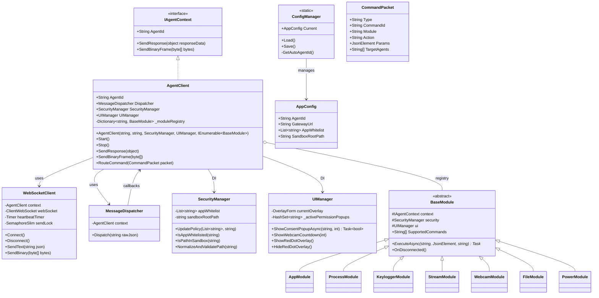

# TÀI LIỆU 1: CLASS DIAGRAM (SƠ ĐỒ LỚP CỦA AGENT)

```mermaid
classDiagram
    class IAgentContext {
        <<interface>>
        +String AgentId
        +SendResponse(object responseData)
        +SendBinaryFrame(byte[] bytes)
    }

    class AgentClient {
        +String AgentId
        +MessageDispatcher Dispatcher
        +SecurityManager SecurityManager
        +UIManager UIManager
        -Dictionary~string, BaseModule~ _moduleRegistry
        +AgentClient(string, string, SecurityManager, UIManager, IEnumerable~BaseModule~)
        +Start()
        +Stop()
        +SendResponse(object)
        +SendBinaryFrame(byte[])
        +RouteCommand(CommandPacket packet)
    }

    class WebSocketClient {
        -AgentClient context
        -ClientWebSocket webSocket
        -Timer heartbeatTimer
        -SemaphoreSlim sendLock
        +Connect()
        +Disconnect()
        +SendText(string json)
        +SendBinary(byte[] bytes)
    }

    class MessageDispatcher {
        -AgentClient context
        +Dispatch(string rawJson)
    }

    class ConfigManager {
        <<static>>
        +AppConfig Current
        +Load()
        +Save()
        -GetAutoAgentId()
    }

    class SecurityManager {
        -List~string~ appWhitelist
        -string sandboxRootPath
        +UpdatePolicy(List~string~, string)
        +IsAppWhitelisted(string)
        +IsPathInSandbox(string)
        +NormalizeAndValidatePath(string)
    }

    class UIManager {
        -OverlayForm currentOverlay
        -HashSet~string~ _activePermissionPopups
        +ShowConsentPopupAsync(string, int) Task~bool~
        +ShowWebcamCountdown(int)
        +ShowRedDotOverlay()
        +HideRedDotOverlay()
    }

    class AppConfig {
        +String AgentId
        +String GatewayUrl
        +List~string~ AppWhitelist
        +String SandboxRootPath
    }

    class CommandPacket {
        +String Type
        +String CommandId
        +String Module
        +String Action
        +JsonElement Params
        +String[] TargetAgents
    }

    class BaseModule {
        <<abstract>>
        #IAgentContext context
        #SecurityManager security
        #UIManager ui
        +String[] SupportedCommands
        +ExecuteAsync(string, JsonElement, string)* Task
        +OnDisconnected()
    }

    class AppModule
    class ProcessModule
    class KeyloggerModule
    class StreamModule
    class WebcamModule
    class FileModule
    class PowerModule

    IAgentContext <|.. AgentClient
    AgentClient --> WebSocketClient : uses
    AgentClient --> MessageDispatcher : uses
    MessageDispatcher --> AgentClient : callbacks
    AgentClient --> SecurityManager : DI
    AgentClient --> UIManager : DI
    AgentClient o-- BaseModule : registry
    
    BaseModule <|-- AppModule
    BaseModule <|-- ProcessModule
    BaseModule <|-- KeyloggerModule
    BaseModule <|-- StreamModule
    BaseModule <|-- WebcamModule
    BaseModule <|-- FileModule
    BaseModule <|-- PowerModule

    ConfigManager --> AppConfig : manages
```