# SƠ ĐỒ LỚP (CLASS DIAGRAM) - AGENT SYSTEM

Sơ đồ dưới đây mô tả cấu trúc hướng đối tượng của ứng dụng Agent, phân tách rõ ràng giữa các lớp xử lý hạ tầng mạng, quản lý bảo mật/giao diện và các phân hệ thực thi lệnh (Modules).

```mermaid
classDiagram
    direction TOP_BOTTOM

    %% ==========================================
    %% CORE SYSTEM COMPONENTS
    %% ==========================================
    class AgentClient {
        -string agentId
        -string gatewayUrl
        -WebSocketClient wsClient
        -MessageDispatcher dispatcher
        -SecurityManager securityManager
        -UIManager uiManager
        -Map~string, BaseModule~ modules
        +start() void
        +stop() void
        +sendResponse(object responseData) void
        +sendBinaryFrame(byte[] bytes) void
        -initializeModules() void
    }

    class WebSocketClient {
        -WebSocket socket
        -bool isConnected
        -int pingIntervalMs
        -Timer heartbeatTimer
        -AgentClient context
        +connect() void
        +disconnect() void
        +sendText(string json) void
        +sendBinary(byte[] bytes) void
        -startHeartbeat() void
        -handleReconnect() void
        -onMessageReceived(string text, byte[] binary) void
    }

    class MessageDispatcher {
        -AgentClient context
        +dispatch(string rawJson) void
        -parseCommand(string json) CommandPacket
    }

    class CommandPacket {
        <<Struct/Model>>
        +string type
        +string command_id
        +string module
        +string action
        +object params
    }

    %% ==========================================
    %% MANAGERS (UTILITIES & CROSS-CUTTING)
    %% ==========================================
    class SecurityManager {
        -List~string~ appWhitelist
        -string sandboxRootPath
        +isAppWhitelisted(string appName) bool
        +isPathInSandbox(string targetPath) bool
        +normalizeAndValidatePath(string relativePath) string
    }

    class UIManager {
        +showConsentPopup(string moduleName, int timeoutMs) bool
        +showWebcamCountdown(int seconds) void
        +showRedDotOverlay() void
        +hideRedDotOverlay() void
    }

    %% ==========================================
    %% MODULE SYSTEM (INHERITANCE)
    %% ==========================================
    class BaseModule {
        <<Abstract>>
        #AgentClient context
        #SecurityManager security
        #UIManager ui
        +execute(string action, object params, string commandId)* void
    }

    class AppModule {
        +execute(string action, object params, string commandId) void
        -getRunningApps() List~AppInfo~
        -startApp(string name) bool
        -stopApp(string name) bool
    }

    class ProcessModule {
        +execute(string action, object params, string commandId) void
        -getProcessList() List~ProcessInfo~
        -killProcess(int pid) bool
    }

    class StreamModule {
        -bool isStreaming
        -int fps
        -int quality
        -Timer streamTimer
        -int sequence
        +execute(string action, object params, string commandId) void
        -startStream(int fps, int quality) void
        -stopStream() void
        -captureAndSendFrame() void
    }

    class KeyloggerModule {
        -bool isLogging
        -IntPtr hookId
        -List~KeyEvent~ buffer
        -Timer flushTimer
        +execute(string action, object params, string commandId) void
        -startLogging() void
        -stopLogging() void
        -keyboardHookProc(int nCode, IntPtr wParam, IntPtr lParam) IntPtr
        -flushBuffer() void
    }

    class FileModule {
        +execute(string action, object params, string commandId) void
        -listDirectory(string path) List~FileEntry~
        -getFileChunk(string path) void
        -saveFileChunk(string path, int chunkIndex, string base64Data) void
    }

    class WebcamModule {
        -bool isCapturing
        -int fps
        -int quality
        -Timer webcamTimer
        -int sequence
        +execute(string action, object params, string commandId) void
        -startWebcam(int fps, int quality) void
        -stopWebcam() void
        -captureAndSendWebcamFrame() void
    }

    class PowerModule {
        +execute(string action, object params, string commandId) void
        -lockMachine() void
        -restartMachine() void
        -shutdownMachine() void
        -sleepMachine() void
    }

    %% ==========================================
    %% RELATIONSHIPS & DEPENDENCIES
    %% ==========================================
    
    %% Composition: AgentClient sở hữu và quản lý vòng đời các thành phần cốt lõi
    AgentClient *-- WebSocketClient
    AgentClient *-- MessageDispatcher
    AgentClient *-- SecurityManager
    AgentClient *-- UIManager
    
    %% Aggregation: AgentClient chứa danh sách các module kế thừa từ BaseModule
    AgentClient o-- BaseModule

    %% Dependency: Dispatcher sử dụng CommandPacket để parse dữ liệu
    MessageDispatcher ..> CommandPacket 

    %% Inheritance: Các module cụ thể kế thừa từ BaseModule
    BaseModule <|-- AppModule
    BaseModule <|-- ProcessModule
    BaseModule <|-- StreamModule
    BaseModule <|-- KeyloggerModule
    BaseModule <|-- FileModule
    BaseModule <|-- WebcamModule
    BaseModule <|-- PowerModule
```

## GHI CHÚ KỸ THUẬT (TECHNICAL NOTES)

### 1. Kiến trúc Hệ thống (System Architecture)

- **Dependency Injection (DI):** `AgentClient` đóng vai trò là container chính. Lớp này khởi tạo các dịch vụ nền (`SecurityManager`, `UIManager`) và truyền tham chiếu của chính nó (`context`) vào các phân hệ (`BaseModule`). Điều này cho phép bất kỳ Module nào cũng có thể gửi phản hồi ngược lại Gateway thông qua `context.sendResponse()`.
    
- **Luồng dữ liệu (Data Flow):** Dữ liệu đến từ `WebSocketClient` $\rightarrow$ được chuyển dưới dạng chuỗi thô (raw JSON) sang `MessageDispatcher` $\rightarrow$ phân tích thành đối tượng `CommandPacket` $\rightarrow$ ánh xạ trường `module` để gọi hàm `execute()` của Module tương ứng.
    

### 2. Thiết kế Lớp (Class Design)

- **Abstract BaseModule:** Lớp trừu tượng cung cấp sẵn các thuộc tính protected (`context`, `security`, `ui`) để các lớp con sử dụng. Bắt buộc lớp con phải nạp chồng (override) phương thức `execute()`. Điều này tuân thủ nguyên lý **Open/Closed Principle (OCP)** – dễ dàng thêm module mới (như AudioModule, NetworkModule) mà không cần sửa đổi lõi điều phối.
    
- **Tách biệt Trách nhiệm (Single Responsibility Principle):** Các tác vụ không liên quan đến business logic của module được đẩy ra ngoài. Việc xác thực thư mục luôn thông qua `SecurityManager`, việc hiển thị đếm ngược luôn thông qua `UIManager`.
    

### 3. Lưu ý Triển khai (Implementation Details)

- **Thread-Safety:** Cần đặc biệt chú ý đồng bộ hóa (lock) tại biến `buffer` trong `KeyloggerModule` vì `keyboardHookProc` (ghi phím) và `flushTimer` (đẩy dữ liệu lên mạng) chạy trên các luồng (thread) khác nhau.
    
- **Cặp dữ liệu Binary:** Trong `StreamModule` và `WebcamModule`, phương thức `captureAndSendFrame()` bắt buộc phải thực thi hai thao tác gửi mạng liên tiếp: `context.sendResponse(frame_meta)` sau đó lập tức gọi `context.sendBinaryFrame(bytes)`.
    
- **Hooks & OS APIs:** Các phương thức như `keyboardHookProc` (Hook phím) hoặc `killProcess` (Diệt tiến trình) sẽ yêu cầu gọi trực tiếp vào Unmanaged Code (Win32 API) thông qua `DllImport` hoặc `System.Diagnostics` tùy thuộc vào ngôn ngữ lập trình (C#/C++).